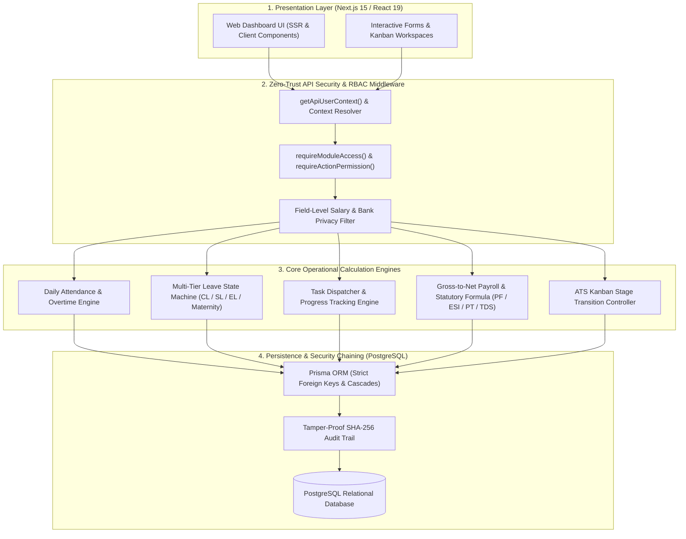
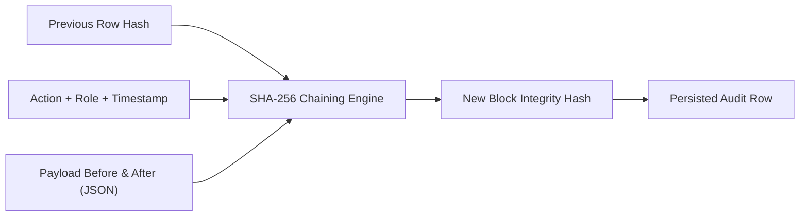

# Viruzverse HRMS — Backend Architecture & API Reference Manual

> **Document Version**: 4.1 (Enterprise Backend & Security Specification)  
> **System Stack**: Next.js 15 (App Router), React 19, TypeScript, Prisma ORM, PostgreSQL  
> **Audience**: Backend Engineers, Frontend Integrators, Security Auditors, and System Administrators  

---

## 1. System Architecture & Layered Flow

The system employs a **defense-in-depth, layered enterprise architecture** separating presentation, security enforcement, business calculation engines, and relational data persistence.



---

## 2. Security & Compliance Protocols

### A. Field-Level Confidentiality & Privacy Masking

> [!IMPORTANT]
> **Zero-Leakage Privacy Guarantee**: Sensitive compensation figures (`Employee.ctc`, `basicSalary`, `netPay`) and banking records are stripped at the API service layer before JSON serialization.

* **Authorized Viewers**:
  * `chairman` (Executive Macro View)
  * `managing_director` (Executive Payroll Disbursal)
  * `hr_head` (Master Payroll Controller)
  * `internal_audit_head` (Forensic Audit Read-Only)
  * `compliance_statutory` (Statutory PF/ESI wage registers)
  * The Employee themselves (`isSelf = true` via `/employees/[myId]`)
* **Standard Staff Queries**:
  * Unprivileged callers querying other colleagues receive `ctc: 0` and redacted bank account/PAN details.

---

### B. Tamper-Proof Cryptographic Audit Logging

> [!NOTE]
> Every write, update, delete, status transition, and financial disbursal generates an immutable row in the `AuditLog` table.



* **Cryptographic Formula**:  
  `integrityHash = SHA-256(previousHash + action + timestamp + JSON.stringify(payloadAfter))`
* **Non-Repudiation**: Guarantees full audit readiness for the Factories Act, EPF & MP Act, and forensic labor inspections.

---

## 3. Standard Request & Response Protocol

### Request Context Headers
Every internal API call passes verified session context headers resolved by authentication middleware:

| Header Name | Type | Description | Example |
| :--- | :--- | :--- | :--- |
| `x-user-role` | `UserRole` | Caller active RBAC role | `hr_head`, `managing_director`, `employee` |
| `x-employee-id` | `string` | Linked employee UUID / Code | `emp_001`, `VV-005` |
| `x-user-id` | `string` | User account UUID | `usr_001` |
| `x-user-email` | `string` | Official corporate email | `vishwadharan.r@viruzverse.com` |

---

### Standard Response Envelopes

#### Success Response (`HTTP 200 / 201`):
```json
{
  "success": true,
  "data": { ... },
  "message": "Optional human-readable confirmation"
}
```

#### Error Response (`HTTP 400 / 403 / 404 / 500`):
```json
{
  "success": false,
  "error": "Detailed error description",
  "code": 403
}
```

---

## 4. Categorized REST API Reference

---

### 🔑 Category 1: Authentication & Session Management

| Endpoint | Method | Permitted Roles | Description |
| :--- | :--- | :--- | :--- |
| `/api/auth/session` | `GET` | All 6 Roles | Retrieves active user persona, role privileges, and employee link. |

---

### 👥 Category 2: Employee Master Data & 360° Dossiers

| Endpoint | Method | Permitted Roles | Description |
| :--- | :--- | :--- | :--- |
| `/api/employees` | `GET` | All 6 Roles | List employee directory with search, department filtering, and role-based salary masking. |
| `/api/employees` | `POST` | `hr_head`, `managing_director` | Creates a new employee dossier with department, branch, and CTC. |
| `/api/employees/[id]` | `GET` | All 6 Roles (Scoped) | Retrieves full 4-tab 360° profile (Overview, Compensation, Statutory, Documents). |
| `/api/employees/[id]` | `PUT` | `hr_head`, `managing_director` | Updates employee master data, designation, and reporting manager. |

---

### ⏱️ Category 3: Attendance, Shifts & Leave Operations

| Endpoint | Method | Permitted Roles | Description |
| :--- | :--- | :--- | :--- |
| `/api/attendance` | `GET` | All 6 Roles (Scoped) | Returns daily attendance muster, punch timestamps, and shift exceptions. |
| `/api/attendance/checkin` | `POST` | `employee`, `hr_head`, `managing_director` | Submits live web clock-in / clock-out with geolocation tagging. |
| `/api/leaves` | `GET` | All 6 Roles (Scoped) | Returns leave applications filtered by role (personal ESS vs team vs plant). |
| `/api/leaves/apply` | `POST` | `employee`, `hr_head`, `managing_director` | Applies for leave with quota deduction and past-date validation. |
| `/api/leaves/allocation` | `GET`, `POST` | `hr_head`, `managing_director`, `chairman` | Configures statutory quota balances in bulk (CL, SL, EL, Maternity, Paternity). |
| `/api/leaves/[id]/action` | `POST` | `hr_head`, `managing_director` | Approves or rejects pending leave / Outdoor Duty (OD) applications. |
| `/api/holidays` | `GET`, `POST` | All 6 Roles (`GET`), HR/MD (`POST`) | Manages annual corporate holiday calendar and board sign-offs. |

---

### 📋 Category 4: Task Allocation & Work Tracking

| Endpoint | Method | Permitted Roles | Description |
| :--- | :--- | :--- | :--- |
| `/api/tasks` | `GET` | All 6 Roles (Scoped) | Fetches tasks (ESS personal list for employees, department board for managers). |
| `/api/tasks` | `POST` | `hr_head`, `managing_director`, `chairman` | Dispatches task to employee with priority, category, deadline & estimated hours. |
| `/api/tasks/[id]` | `PATCH` | All 6 Roles (Scoped) | Updates progress %, logged hours, deliverable notes, or manager 5-star review. |
| `/api/tasks/[id]` | `DELETE` | `hr_head`, `managing_director` | Deletes or archives a task assignment. |

---

### 💰 Category 5: Payroll, Statutory Dues & Payslips

| Endpoint | Method | Permitted Roles | Description |
| :--- | :--- | :--- | :--- |
| `/api/payroll/runs` | `GET` | All 6 Roles (Scoped) | Monthly payroll batches (Admins/Audit) or individual payslips (Employees). |
| `/api/payroll/calculate`| `POST` | `hr_head` | Executes gross-to-net salary batch calculation with EPF, ESI, PT, and TDS. |
| `/api/payroll/disburse` | `POST` | `managing_director` | Authorizes final salary disbursal and unlocks printable employee payslips. |

---

### 📈 Category 6: Talent, Performance & Grievance (POSH)

| Endpoint | Method | Permitted Roles | Description |
| :--- | :--- | :--- | :--- |
| `/api/recruitment` | `GET`, `POST` | `hr_head`, `managing_director`, `chairman` | Manpower requisitions and candidate ATS Kanban stage transitions. |
| `/api/performance` | `GET`, `POST` | `hr_head`, `managing_director`, `chairman`, `employee` | Annual KRA appraisals, 9-box talent matrix calibration & self-ratings. |
| `/api/training` | `GET`, `POST` | All 6 Roles | Technical skill workshops, EHS safety compliance, and enrollment tracking. |
| `/api/grievances` | `GET`, `POST` | All 6 Roles | Confidential POSH / HR grievance ticket submission with automated 7-day SLA countdown. |

---

### 📊 Category 7: Executive MIS, Compliance & Forensic Audit

| Endpoint | Method | Permitted Roles | Description |
| :--- | :--- | :--- | :--- |
| `/api/reports` | `GET` | `chairman`, `managing_director`, `hr_head`, `internal_audit_head`, `compliance_statutory` | Multi-dimensional MIS executive scorecards, turnover rates, and payroll variances. |
| `/api/audit-logs` | `GET` | `chairman`, `managing_director`, `hr_head`, `internal_audit_head` | Tamper-evident activity logs with SHA-256 integrity hash verification. |
| `/api/compliance` | `GET`, `POST` | `compliance_statutory`, `hr_head`, `chairman`, `managing_director` | Corporate governance policies, safety directives, and PDF uploads. |

---

## 5. Standard HTTP Status Code Reference

| Status Code | Meaning | System Scenario |
| :--- | :--- | :--- |
| `200 OK` | Success | Standard read or update operation succeeded. |
| `201 Created` | Created | New employee, leave request, task, or policy successfully created. |
| `400 Bad Request` | Validation Error | Missing required fields, invalid date range, or negative quota. |
| `401 Unauthorized` | Missing Auth | Request missing valid user session tokens. |
| `403 Forbidden` | Access Denied | RBAC check failed (e.g. employee accessing payroll disbursals). |
| `404 Not Found` | Entity Missing | Requested record ID does not exist in database. |
| `500 Server Error` | Execution Fault | Unhandled exception logged to server error stream. |

---
*End of Backend Architecture & API Reference Manual — Viruzverse HRMS v4.1.*
