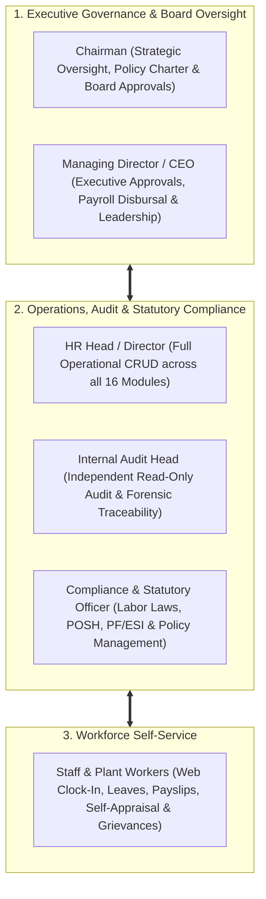
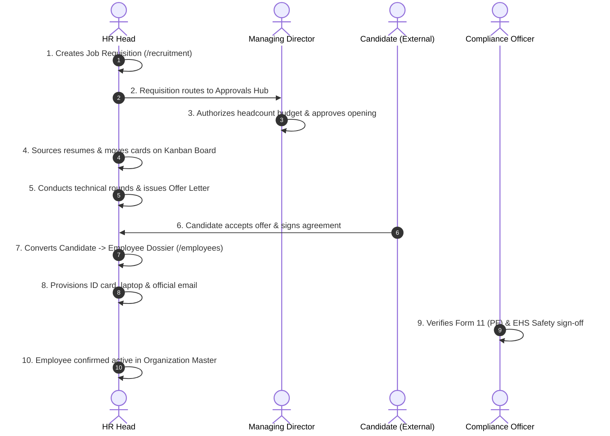
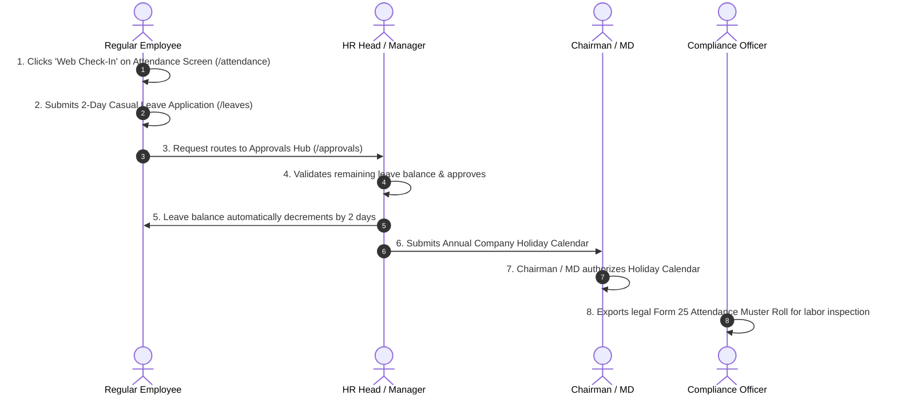
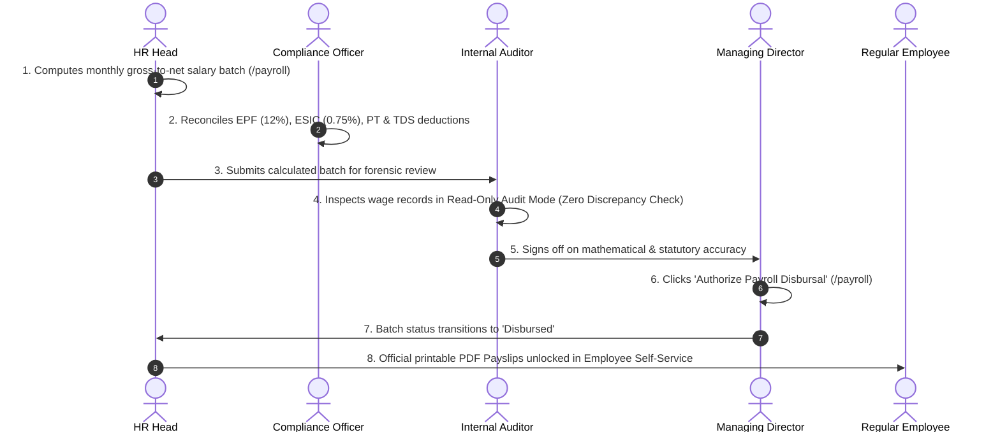
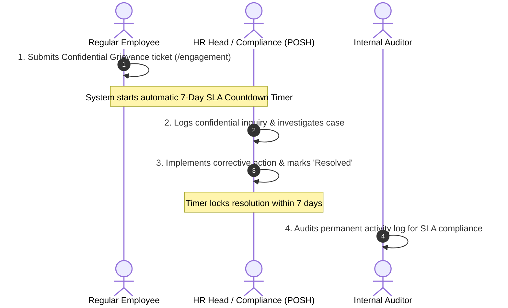
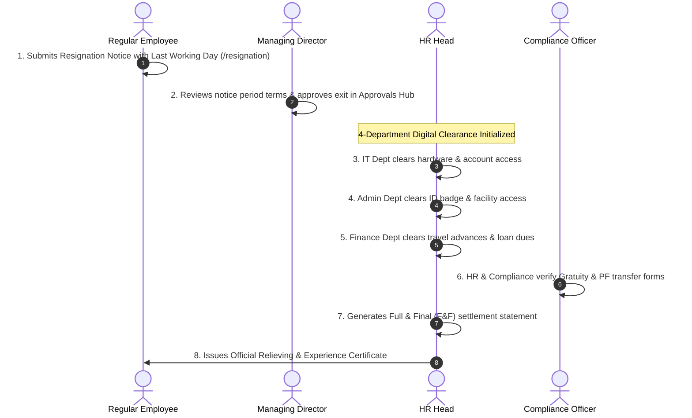

# Viruzverse HRMS — Comprehensive Architecture, RBAC Security, Multi-Persona Workflows & Data Relationships Manual

> **Document Version**: 4.0 (Enterprise Architecture & Implementation Edition)  
> **Target Audience**: Business Owners, CTOs, HR Directors, Compliance Officers, Lead Architects, Developers, and QA Engineers.  
> **Applicable Domains**: Multi-Plant Manufacturing, Hospitals & Healthcare, Retail Chains, Logistics & Warehousing, Corporate Enterprises, and IT Services.

---

## 1. System Overview & Core Architectural Guarantees

**Viruzverse HRMS** is an enterprise-grade Human Resource Management System engineered to govern the entire employee lifecycle—from initial talent requisition and candidate sourcing to daily shift attendance, payroll processing, statutory compliance, performance calibration, and offboarding clearance.

### Core Architectural Guarantees:
1. **Strict Principle of Least Privilege (Zero-Trust RBAC)**: Each of the 6 roles has access *only* to their designated screens and functional operations. Unauthorized screen access is blocked at the routing layer (`RBACGuard.tsx`) and API layer (`rbac-guard-api.ts`).
2. **Strict Separation of Duties**: Auditors cannot edit payroll or candidate data; Compliance officers cannot score performance appraisals; Employees cannot see organizational directories or compensation data; Chairmen do not handle routine operational tasks.
3. **Forensic Audit Traceability (Tamper-Evident)**: Every write, update, delete, and approval action generates an append-only audit record in PostgreSQL with an SHA-256 integrity hash.
4. **Field-Level Privacy & Salary Masking**: Sensitive compensation figures, bank account details, and government IDs are masked from unauthorized roles and restricted to authorized personnel and the employee's own self-service portal.

---

## 2. The 6 Roles, Responsibilities & Strict Boundaries

---

### Role 1: Chairman of the Board (`chairman`)
* **Role Character**: Board Leader & Chief Governance Officer.
* **Core Mandate**: High-level strategic oversight, executive appointments, board governance, corporate policy charters, and macro workforce budgets.
* **Primary Responsibilities**:
  * Review organization-wide headcount, salary cost distribution, and retention analytics on the Executive Dashboard (`/dashboard`) and Reports (`/reports`).
  * Sign off on executive-level promotions, director appointments, and annual company holiday calendars in the Approvals Hub (`/approvals`).
  * Create, edit, and authorize corporate governance bylaws and safety charters in Policy & Compliance (`/compliance`).
  * Review senior leadership succession pipelines and the executive 9-Box talent grid in Performance (`/performance`).
* **Strict Role Boundaries (What the Chairman MUST NOT DO)**:
  * ❌ Cannot create, edit, or delete operational employee records, daily attendance punches, or shift rosters.
  * ❌ Cannot process monthly payroll wage calculations or edit candidate hiring stages.
  * ❌ Does not undergo routine staff lifecycle tracking (no biometric punch clocks, shift rosters, or tool clearance).

---

### Role 2: Managing Director / CEO (`managing_director`)
* **Role Character**: Chief Executive Officer & Operational Authority.
* **Core Mandate**: Enterprise leadership, organizational KPIs, final operational approvals, and executive sign-offs.
* **Primary Responsibilities**:
  * Monitor real-time enterprise metrics (attendance, active headcounts, open requisitions) on the Dashboard (`/dashboard`).
  * Final authorizer for **Monthly Payroll Disbursals** (`/payroll`), transferring calculated batches from *Verified* to *Disbursed*.
  * Approve new manpower hiring requisitions (`/recruitment`) and review executive candidate offers.
  * Approve branch transfers, grade promotions, and annual salary revisions in Movements (`/movement`).
  * Sign off on major disciplinary inquiry sanctions (suspensions/terminations) in Disciplinary (`/disciplinary`).
  * Authorize executive leave applications and final resignation notice period waivers (`/resignation`).
* **Strict Role Boundaries (What the MD MUST NOT DO)**:
  * ❌ Does not perform day-to-day data entry (e.g. typing candidate notes, adjusting manual attendance minutes).
  * ❌ Does not alter historical audit logs or bypass statutory deduction calculations.

---

### Role 3: HR Head / HR Director (`hr_head`)
* **Role Character**: Master Administrator of People Operations.
* **Core Mandate**: End-to-end administration and execution across all 16 HR modules.
* **Primary Responsibilities (Full CRUD)**:
  * Maintain Master Employee Directory (`/employees`) and manage the 4-tab Employee 360° dossiers (`/employees/[id]`).
  * Manage the Candidate Hiring Pipeline Kanban board from *Sourced* to *Offer Letter* (`/recruitment`).
  * Monitor daily attendance logs, correct missed punches, and configure shift rosters (`/attendance`).
  * Process leave requests, adjust leave entitlements, and manage team calendars (`/leaves`).
  * Compute monthly gross-to-net salary batches with PF, ESI, PT, and TDS deductions (`/payroll`).
  * Configure annual performance cycles, manage 9-Box talent grids, and distribute bonus pools (`/performance`).
  * Schedule technical training programs and monitor employee feedback scores (`/training`).
  * Investigate workplace complaints and resolve grievances within the mandatory 7-day SLA (`/engagement`).
  * Coordinate 4-department offboarding clearances (IT, Admin, Finance, HR) and issue official relieving letters (`/resignation`).
  * Configure organization settings, departments, designations, and branches (`/settings`).
* **Strict Role Boundaries (What the HR Head MUST NOT DO)**:
  * ❌ Cannot disburse payroll without MD authorization.
  * ❌ Cannot delete or tamper with permanent system audit logs.

---

### Role 4: Internal Audit Head (`internal_audit_head`)
* **Role Character**: Independent Checker & Forensic Compliance Auditor.
* **Core Mandate**: Verification of financial integrity, preventing payroll fraud/ghost workers, and validating adherence to company policies.
* **Primary Responsibilities (Read-Only Forensic Access)**:
  * Audit monthly payroll batches (`/payroll`) in **Read-Only Audit Mode** to verify zero-variance math, statutory tax deductions, and bank transfer totals.
  * Search and inspect the permanent, tamper-evident **System Activity Log Stream** (`/settings`) by user, timestamp, and module.
  * Inspect active staff records (`/employees`) to ensure all individuals on payroll are real, verified employees.
  * Review disciplinary inquiry proceedings (`/disciplinary`) to ensure procedural fairness.
  * Inspect past manager approval records (`/approvals`) for policy compliance.
* **Strict Role Boundaries (What the Auditor MUST NOT DO)**:
  * ❌ **STRICTLY FORBIDDEN from creating, editing, updating, or deleting any business records** (salaries, employee profiles, job openings, leave approvals).
  * ❌ Cannot access candidate sourcing pipelines or create company policies.

---

### Role 5: Compliance & Statutory Officer (`compliance_statutory`)
* **Role Character**: Legal Guardian & Labor Law Administrator.
* **Core Mandate**: Statutory compliance under the Factories Act, EPF & MP Act, ESI Act, POSH Act, and State Labor Laws.
* **Primary Responsibilities (Full CRUD on Policies & Statutory Records)**:
  * Author, publish, update, and manage official company policies, safety manuals, and signed PDF directives (`/compliance`).
  * Generate and export legal **Form 25 / Form T Muster Rolls** and shift registers (`/attendance`).
  * Reconcile and audit monthly **PF (12%), ESI (0.75%), and PT** statutory deduction statements prior to salary disbursal (`/payroll`).
  * Head the **Internal Complaints Committee (ICC)** under the POSH Act, logging confidential cases and generating annual statutory returns (`/engagement`).
  * Schedule and track mandatory industrial health, fire safety, and EHS hazard training sessions (`/training`).
  * Audit exit gratuity calculations and verify statutory PF transfer sign-offs during offboarding (`/resignation`).
* **Strict Role Boundaries (What the Compliance Officer MUST NOT DO)**:
  * ❌ Cannot conduct technical job interviews or hire recruitment candidates.
  * ❌ Cannot alter performance appraisal scores or assign employee promotions.

---

### Role 6: Regular Employee (`employee`)
* **Role Character**: Staff Member & Self-Service Portal User.
* **Core Mandate**: Manage personal work records, attendance, leaves, and career development through Employee Self-Service (ESS).
* **Primary Responsibilities (Self-Service Only)**:
  * Perform daily **Web Clock-In / Clock-Out** and view personal attendance logs (`/attendance`).
  * Submit leave applications (Casual, Sick, Earned) and track manager approval status (`/leaves`).
  * View personal 4-tab profile 360 dossier (`/employees/[myId]`) with personal documents and bank info.
  * Download official monthly PDF payslips showing basic pay, allowances, and statutory deductions (`/payroll`).
  * Complete annual self-appraisal ratings and achievements (`/performance`).
  * Enroll in company training workshops and submit post-training feedback (`/training`).
  * Submit confidential grievances directly to HR/POSH with an automated **7-day resolution SLA timer** (`/engagement`).
  * Submit official resignation notice and monitor multi-department clearance progress (`/resignation`).
* **Strict Role Boundaries (What the Employee MUST NOT DO)**:
  * ❌ **STRICTLY BLOCKED from viewing any other employee's profile, salary, leaves, or documents**.
  * ❌ Cannot access candidate pipelines, approval queues, company analytics, or system settings.

---

## 3. Master Screen Access & RBAC Capability Matrix

The following matrix maps all **16 application screens** across all **6 roles**, defining exact permission levels:
* **F** = Full Access (Create / Read / Update / Delete / Approve)
* **E** = Edit / Process designated functional area
* **A** = Approve / Authorize requests
* **V** = View / Read-Only access
* **S** = Self-Service only (Own personal record)
* **NONE** = Forbidden / Hidden from sidebar navigation and blocked by `RBACGuard`

| Screen Route | Functional Area | Chairman | Managing Director | HR Head | Internal Auditor | Compliance Officer | Regular Employee |
| :--- | :--- | :---: | :---: | :---: | :---: | :---: | :---: |
| `/dashboard` | Executive / Operational Dashboard | **F** (Macro) | **F** (Enterprise) | **F** (Ops) | **V** (Audit) | **V** (Legal) | **S** (Personal) |
| `/approvals` | Central Approvals Hub (7 Queues) | **A** (Board) | **A** (Executive) | **A** (Full) | **V** (Audit) | **V** (Legal) | **NONE** |
| `/reports` | Enterprise BI Analytics & Export | **F** (Macro) | **F** (Detailed) | **F** (Ops) | **V** (Audit) | **V** (Statutory) | **NONE** |
| `/employees` | Master Staff Directory | **V** | **F** | **F** | **V** (Ghost Check) | **V** | **NONE** |
| `/employees/[id]`| 4-Tab Employee 360° Dossier | **V** | **V** (Full) | **F** | **V** (Read-Only) | **V** (Statutory) | **S** (Own ID) |
| `/recruitment` | Job Requisitions & Kanban ATS | **V** | **A** (Hires) | **F** | **NONE** | **NONE** | **NONE** |
| `/attendance` | Clock-In, Shifts & Form 25 Muster| **V** | **A** (Overtime) | **F** | **NONE** | **V** (Form 25) | **S** (Clock-In) |
| `/leaves` | Leave Applications & Calendars | **A** (Holidays)| **A** (Execs) | **F** | **NONE** | **V** (Labor Laws) | **S** (Apply) |
| `/payroll` | Gross-to-Net Salaries & Payslips| **V** (Budget)| **A** (Disbursal) | **F** | **V** (Forensic) | **E** (PF/ESI) | **S** (Payslips) |
| `/performance` | Appraisals & 9-Box Talent Matrix | **F** (Exec) | **F** (Calib) | **F** | **NONE** | **NONE** | **S** (Self-Rate) |
| `/training` | Skills Workshops & Safety EHS | **V** | **V** | **F** | **NONE** | **E** (Safety EHS) | **S** (Enroll) |
| `/engagement` | Grievances (7-Day SLA) & POSH | **V** | **V** | **F** | **NONE** | **E** (POSH Head) | **S** (Grievance) |
| `/movement` | Transfers & Grade Promotions | **A** (Senior) | **F** | **F** | **NONE** | **NONE** | **NONE** |
| `/disciplinary`| Misconduct Inquiries & Sanctions| **V** | **A** (Sanctions) | **F** | **V** (Fairness) | **V** (Legal) | **NONE** |
| `/resignation` | 4-Department Exit Clearance & F&F| **V** | **A** (Exits) | **F** | **NONE** | **E** (Gratuity) | **S** (Resign) |
| `/compliance` | Corporate Policies & PDF Uploads | **F** (Charter)| **F** (Charter) | **F** | **V** (Rules) | **F** (Full CRUD) | **NONE** |
| `/settings` | Organization Setup & Audit Logs | **V** | **F** | **F** | **V** (Audit Log) | **V** (Config) | **NONE** |

---

## 4. Relational Data Architecture & Entity Relationships

The PostgreSQL database (managed via Prisma ORM in `prisma/schema.prisma`) enforces strict relational integrity with foreign keys, cascade protections, and unique constraints.

```mermaid
erDiagram
    ORGANIZATION ||--o{ BRANCH : "has"
    ORGANIZATION ||--o{ DEPARTMENT : "has"
    ORGANIZATION ||--o{ DESIGNATION : "has"
    ORGANIZATION ||--o{ USER : "maintains"
    ORGANIZATION ||--o{ EMPLOYEE : "employs"
    ORGANIZATION ||--o{ COMPANY_POLICY : "publishes"
    ORGANIZATION ||--o{ AUDIT_LOG : "records"

    USER ||--o| EMPLOYEE : "links (1:1)"
    USER ||--o{ USER_SESSION : "authorizes"
    USER ||--o{ NOTIFICATION : "receives"

    DEPARTMENT ||--o{ DESIGNATION : "defines"
    DEPARTMENT ||--o{ EMPLOYEE : "contains"
    DEPARTMENT ||--o| EMPLOYEE : "headed by (1:1)"

    EMPLOYEE ||--o| BANK_DETAILS : "has (1:1)"
    EMPLOYEE ||--o| STATUTORY_INFO : "has (1:1)"
    EMPLOYEE ||--o{ EMERGENCY_CONTACT : "lists (1:N)"
    EMPLOYEE ||--o{ ATTENDANCE_RECORD : "clocks (1:N)"
    EMPLOYEE ||--o{ LEAVE_ALLOCATION : "holds (1:N)"
    EMPLOYEE ||--o{ LEAVE_REQUEST : "applies (1:N)"
    EMPLOYEE ||--o{ PAYSLIP : "receives (1:N)"
    EMPLOYEE ||--o{ PERFORMANCE_REVIEW : "evaluated (1:N)"
    EMPLOYEE ||--o{ GRIEVANCE_TICKET : "files (1:N)"
    EMPLOYEE ||--o{ RESIGNATION_EXIT_CASE : "initiates (1:N)"
    EMPLOYEE ||--o{ TRANSFER_PROMOTION_CASE : "assigned (1:N)"
    EMPLOYEE ||--o{ DISCIPLINARY_CASE : "subject of (1:N)"
    EMPLOYEE ||--o{ TRAINING_ENROLLMENT : "attends (N:M)"
    EMPLOYEE ||--o{ EMPLOYEE : "manages (Self-Ref 1:N)"

    JOB_REQUISITION ||--o{ CANDIDATE : "attracts (1:N)"
    PAYROLL_RUN ||--o{ PAYSLIP : "generates (1:N)"
    RESIGNATION_EXIT_CASE ||--o{ DEPARTMENT_CLEARANCE : "requires (1:4)"
    TRAINING_PROGRAM ||--o{ TRAINING_ENROLLMENT : "enrolls (1:N)"
```

### Relational Cardinalities & Business Rules:
1. **User to Employee (`1:1 Optional`)**:
   * Every operational staff member has a `User` account linked via `employeeId`.
   * High-level governance entities (e.g. `usr_chairman`) exist in `User` without an operational `Employee` record.
2. **Employee to Manager (`Self-Referencing 1:N`)**:
   * `Employee.reportingManagerId` references `Employee.id`, creating the organizational hierarchy.
3. **Employee to 360 Information Sub-tables (`1:1 & 1:N`)**:
   * `BankDetails`: 1:1 relation storing encrypted account numbers, IFSC, and PAN.
   * `StatutoryInfo`: 1:1 relation storing Universal Account Number (UAN), PF ID, and ESI IP Number.
   * `EmergencyContact`: 1:N relation storing prioritized personal contacts.
4. **Payroll Run to Payslip (`1:N`)**:
   * A single monthly `PayrollRun` entity groups all individual employee `Payslip` records for that calendar cycle.
5. **Resignation to Department Clearances (`1:4 Fixed`)**:
   * Each `ResignationExitCase` automatically instantiates 4 digital clearance tokens (`IT`, `Admin`, `Finance`, `HR/Statutory`).
6. **Job Requisition to Candidate (`1:N`)**:
   * A single approved `JobRequisition` tracks multiple applicant cards across the Kanban stages (`applied`, `shortlisted`, `technical_eval`, `hr_round`, `offered`, `hired`).

---

## 5. End-to-End Multi-Persona Operational Workflows

---

### Workflow 1: Talent Acquisition to Day-1 Onboarding

---

### Workflow 2: Daily Attendance, Leaves & Statutory Muster

---

### Workflow 3: Monthly Payroll Calculation, Forensic Audit & Disbursal

---

### Workflow 4: Confidential Grievance & POSH Resolution (Strict 7-Day SLA)

---

### Workflow 5: Resignation, 4-Department Clearance & Final Settlement (F&F)

---

## 6. Code Health & Verification Standards

* **TypeScript Compilation**: The system must compile with **0 errors** at all times (`npx tsc --noEmit`).
* **Database Synchronicity**: Prisma schema must be in 100% alignment with PostgreSQL (`npm run db:push`).
* **Seed Data Integrity**: Seed scripts (`npm run db:seed`) must populate all 6 core personas, departments, designations, branches, and sample records.
* **Security Guarding**: Direct URL access to forbidden screens must return **HTTP 403 Forbidden** via `RBACGuard`.

---
*End of Comprehensive Architecture & Multi-Persona Manual — Viruzverse HRMS v4.0.*
