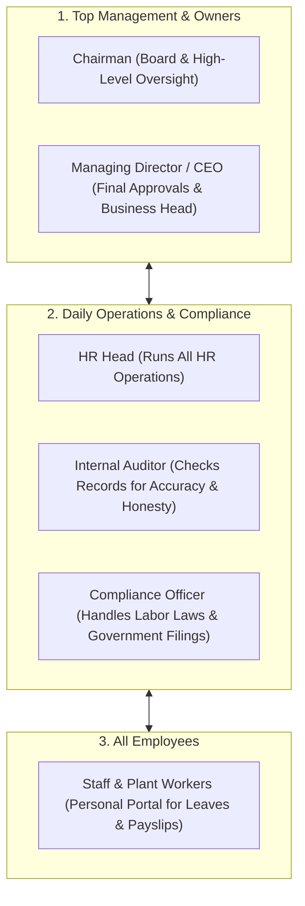
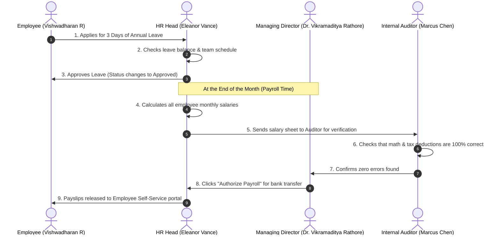

# Viruzverse HRMS — Complete System & Role Guide (Plain Language Edition)

> **Document Version**: 3.2 (Simple & Easy-to-Understand Edition)  
> **Who is this for?**: Business Owners, Executives, HR Managers, Auditors, Compliance Officers, and Employees.  
> **Applicable For**: Any type of business (Factories & Manufacturing, Hospitals & Healthcare, Retail Stores, Logistics & Warehousing, Corporate Offices, and IT Companies).  

---

## 1. What is this System? (In Simple Words)

**Viruzverse HRMS** is an all-in-one software platform that manages everything related to employees across their entire time with the company—from the day they are interviewed, to daily attendance and monthly salary payouts, all the way to their final retirement or resignation.



### Three Key Guarantees of the System:
1. **Works for Any Industry**: Handles office staff, factory shift workers, shop assistants, and healthcare staff equally well.
2. **Strict Privacy & Permissions**: Nobody can see what they are not supposed to see. Regular staff cannot see other people's salaries, and managers cannot bypass company rules.
3. **Permanent Activity History**: Every time someone creates, edits, approves, or deletes something, the system saves a permanent record that cannot be secretly altered by anyone.

---

## 2. The 6 Roles & Their Responsibilities (In Plain English)

---

### Role 1: Chairman of the Board (`chairman`)

* **Who is this person?**: The Head of the Board of Directors or company owner.
* **Their Job in Simple Words**: They look at the "big picture"—overall workforce growth, total monthly company salary costs, high-level business reports, and long-term company policies. They do not get involved in daily tasks like approving casual sick leaves.

#### What Screens Can the Chairman Access?

| Screen | What it is for | What the Chairman Can Do |
| :--- | :--- | :--- |
| **Executive Dashboard** (`/dashboard`) | High-level summary of total staff, total monthly payroll cost, and department headcount. | **View all numbers & graphs** |
| **Approvals Hub** (`/approvals`) | Review top-level decisions. | **Approve or Reject**: Director appointments, annual company holiday calendars, and executive promotions. |
| **Company Reports** (`/reports`) | View full business analytics. | **View and download**: Salary budget charts, employee turnover trends, and attendance summaries. |
| **Staff Directory** (`/employees`) | List of all company employees. | **View list & department charts** (Read-only). |
| **Company Policies** (`/compliance`) | Official rulebooks and bylaws. | **Create, Edit, and Approve** company rules and code of conduct. |
| **Performance Review** (`/performance`) | High-level staff rating summaries. | **View** leadership talent ratings and executive succession plans. |
| **Settings & History** (`/settings`) | System setup and activity log. | **View** organizational settings and audit logs. |

#### What is the Chairman NOT Allowed to Do?
* Cannot edit daily attendance punches or manage day-to-day employee leaves (that is HR's job).
* Cannot edit individual payslips or job applicant interviews.

---

### Role 2: Managing Director / CEO (`managing_director`)

* **Who is this person?**: The Chief Executive Officer who runs the entire company day-to-day.
* **Their Job in Simple Words**: The MD gives final sign-offs on hiring new staff, authorizes the monthly salary bank transfers, approves executive transfers between branches/factories, and decides on major disciplinary actions.

#### What Screens Can the Managing Director Access?

| Screen | What it is for | What the MD Can Do |
| :--- | :--- | :--- |
| **Executive Dashboard** (`/dashboard`) | Real-time overview of attendance, open job positions, and monthly salary totals. | **Full View** of all live company metrics. |
| **Approvals Hub** (`/approvals`) | Central place to review pending company requests. | **Final Approver for**: Monthly salary disbursals, new hiring requests, high-level leaves, plant transfers, and resignations. |
| **Company Reports** (`/reports`) | In-depth company reports. | **View & Export** all workforce, attendance, and financial reports. |
| **Staff Directory** (`/employees`) | List of all employees across all branches. | **Full View** of all employee profiles and records. |
| **Hiring & Job Openings** (`/recruitment`) | Job openings and applicants. | **Approve** new job openings and review final candidate offers. |
| **Attendance & Shifts** (`/attendance`) | Daily attendance and shift compliance. | **View** company-wide attendance and overtime summaries. |
| **Leave Management** (`/leaves`) | Leave records. | **Approve or Reject** leaves for Department Heads and direct managers. |
| **Payroll & Salaries** (`/payroll`) | Monthly salary batch calculations. | **Click "Authorize Payroll"** to give final approval for salary bank transfers. |
| **Performance & Ratings** (`/performance`) | Annual employee rating system. | **Review and approve** company-wide appraisal ratings and annual bonus pools. |
| **Transfers & Promotions** (`/movement`) | Employee role and branch transfers. | **Approve or reject** promotions, salary hikes, and location transfers. |
| **Disciplinary Cases** (`/disciplinary`) | Misconduct investigations. | **Review evidence** and sign off on official warnings, suspensions, or terminations. |
| **Resignations & Exits** (`/resignation`) | Employees leaving the company. | **Approve** notice period waivers and final exit clearances. |
| **Company Policies** (`/compliance`) | Official rulebooks. | **Approve & Publish** all company policies and safety rules. |
| **System Settings** (`/settings`) | Company departments and branches. | **Full Access** to configure departments, designations, and view system history. |

---

### Role 3: HR Head / HR Director (`hr_head`)

* **Who is this person?**: The master administrator in charge of all people operations.
* **Their Job in Simple Words**: The HR Head handles the complete 17-step journey of every employee—posting jobs, hiring candidates, taking care of day-1 joining, tracking daily biometric attendance, calculating monthly salaries, setting up training, resolving complaints, and processing final settlements when someone leaves.

#### What Screens Can the HR Head Access?

| Screen | What it is for | What the HR Head Can Do (Full CRUD) |
| :--- | :--- | :--- |
| **HR Operations Dashboard** (`/dashboard`) | Live overview of active staff, today's attendance, and pending HR tasks. | **Full Control**: View and take action on all operational alerts. |
| **Approvals Hub** (`/approvals`) | Queue of all company requests. | **Process & Approve**: Staff leaves, job requests, transfers, promotions, and exit clearances. |
| **HR Reports** (`/reports`) | Detailed workforce data. | **Generate & Download**: Overtime reports, salary sheets, leave balances, and training attendance. |
| **Staff Directory** (`/employees`) | Master list of all staff. | **Add, Edit, Update, and Archive** employee profiles, bank details, and job titles. |
| **Employee 360 Profile** (`/employees/[id]`) | Detailed profile page for any worker. | **Edit all information**: Personal details, salary breakdown, documents, and 17-stage career progress. |
| **Hiring & Job Openings** (`/recruitment`) | Job applicant tracker (Kanban board). | **Create job posts**, move candidate cards from "Applied" $\rightarrow$ "Interview" $\rightarrow$ "Offer Letter". |
| **Attendance & Logs** (`/attendance`) | Daily punch-in/out records. | **Monitor daily clock-ins**, correct missed punches, assign shift schedules. |
| **Leave Management** (`/leaves`) | Staff leave requests. | **Approve/Reject leaves**, set up annual holiday calendar, manage leave balances. |
| **Payroll & Benefits** (`/payroll`) | Monthly salary calculation. | **Calculate gross-to-net salaries**, add bonuses, calculate deductions, print official payslips. |
| **Performance & Ratings** (`/performance`) | Annual appraisal cycles. | **Set up rating questions**, assign reviewers, collect scores, calculate overall ratings. |
| **Training & Skills** (`/training`) | Staff workshops & courses. | **Create training sessions**, enroll staff, track attendance and feedback scores. |
| **Welfare & Grievances** (`/engagement`) | Employee surveys & complaints. | **Review employee complaints**, launch surveys, ensure problems are solved within 7 days. |
| **Transfers & Promotions** (`/movement`) | Promotions & branch transfers. | **Create transfer orders**, change job titles, issue official promotion letters. |
| **Disciplinary Records** (`/disciplinary`) | Workplace misconduct cases. | **Record rule violations**, issue show-cause letters, document inquiry findings. |
| **Resignations & Exits** (`/resignation`) | Staff leaving the company. | **Coordinate no-dues clearance** with IT/Admin/Finance, calculate final payout (gratuity/leave balance). |
| **Company Policies** (`/compliance`) | Policy documents & rulebook. | **Add, Edit, Publish, and Delete** corporate policy documents and upload signed PDF copies. |
| **System Settings** (`/settings`) | Organization setup. | **Add/Edit** departments, job titles, shift timings, and view system activity logs. |

---

### Role 4: Internal Audit Head (`internal_audit_head`)

* **Who is this person?**: The independent auditor who checks the company's records for honesty, accuracy, and fairness.
* **Their Job in Simple Words**: The auditor acts as a neutral checker. They check that salaries are calculated correctly (no math errors or ghost workers), verify that leaves and promotions follow company rules, and inspect the permanent activity history to ensure nobody has tampered with past records.

#### What Screens Can the Auditor Access?

| Screen | What it is for | What the Auditor Can Do |
| :--- | :--- | :--- |
| **Audit Dashboard** (`/dashboard`) | Overview of audit checks and variance indicators. | **View-Only**: Check that monthly figures balance correctly with zero discrepancies. |
| **Salary & Pay Audit** (`/payroll`) | Monthly salary records. | **Deep Check (Read-Only)**: Verifies that salary math is 100% correct, tax deductions match the law, and there are no unauthorized bonus additions. |
| **System Activity History** (`/settings`) | Permanent log of every action taken in the system. | **Full View & Search**: Can search who did what, at what time, from what computer, and confirm that no records were secretly changed. |
| **Policy & Rulebook** (`/compliance`) | Company policies. | **View-Only**: Confirms all policies are up to date and employees have acknowledged them. |
| **Disciplinary Cases** (`/disciplinary`) | Misconduct records. | **View-Only**: Checks that employee inquiries were handled fairly according to company rules. |
| **Staff Directory** (`/employees`) | List of all employees. | **View-Only**: Audits that all listed employees are real active workers (prevents ghost-worker fraud). |
| **Approvals Hub** (`/approvals`) | History of manager approvals. | **View-Only**: Checks that managers approve requests on time without rule violations. |

#### What is the Auditor NOT Allowed to Do?
* **Cannot create, edit, or delete any employee, salary, or candidate records**. (This ensures complete independence—an auditor must only check work, not do the work).
* Cannot access the candidate hiring pipeline.

---

### Role 5: Compliance & Statutory Officer (`compliance_statutory`)

* **Who is this person?**: The company's legal and labor law guardian.
* **Their Job in Simple Words**: This person ensures the company obeys all government labor laws, safety rules (Factories Act), anti-harassment laws (POSH Act), and handles monthly government savings filings (PF, ESI, Tax withholding). They also maintain legal registers required during government labor inspections.

#### What Screens Can the Compliance Officer Access?

| Screen | What it is for | What the Compliance Officer Can Do |
| :--- | :--- | :--- |
| **Compliance Dashboard** (`/dashboard`) | Overview of government deadlines, safety status, and POSH cases. | **View** all legal and safety reminders. |
| **Policy & Statutory Compliance** (`/compliance`) | Company rules, safety manuals & legal documents. | **Full Control (Create, Edit, Update, Delete)**: Publishes policies (Safety, Code of Conduct, Anti-Harassment, IT Security), uploads signed PDF documents, and tracks which employees have signed them. |
| **Statutory Filings (PF/ESI)** (`/payroll`) | Government deductions in salaries. | **Process & Reconcile**: Verifies Provident Fund (PF), State Insurance (ESI), and Tax deductions before salaries are paid; exports monthly government filing sheets. |
| **Statutory Attendance (Form 25)** (`/attendance`) | Official government attendance register. | **View & Export**: Generates and downloads legal **Form 25 / Form T Muster Rolls** required during factory/labor inspections. |
| **Statutory Leave Records** (`/leaves`) | Government-mandated leave registers. | **View & Audit**: Checks that maternity leaves, earned leaves, and festival holidays match state labor laws. |
| **POSH & Welfare Committee** (`/engagement`) | Prevention of Sexual Harassment (POSH) & worker welfare. | **Process & Manage**: Heads the Anti-Harassment Committee, logs confidential inquiries, ensures worker safety, and drafts annual government reports. |
| **Safety & Factory Training** (`/training`) | Fire safety and workplace hazard training. | **Schedule & Track**: Ensures workers complete mandatory industrial safety and health training. |
| **Exit & Gratuity Clearances** (`/resignation`) | Staff leaving the company. | **Audit & Sign-Off**: Verifies that resigning workers receive their legal gratuity, leave payouts, and PF transfer papers before final exit. |
| **Settings & History** (`/settings`) | System configuration. | **View-Only**: Inspects company settings and compliance audit logs. |

#### What is the Compliance Officer NOT Allowed to Do?
* Cannot interview or hire job applicants (avoids conflict of interest).
* Cannot score employee performance appraisals or decide on promotions.

---

### Role 6: Regular Employee (`employee`) [Self-Service Portal]

* **Who is this person?**: Any employee or plant worker in the company.
* **Their Job in Simple Words**: Employees use their private self-service portal on their computer or mobile to clock in daily, apply for leaves, download their monthly payslips, see upcoming holidays, submit their yearly self-appraisal, and file confidential questions or complaints.

#### What Screens Can an Employee Access?

| Screen | What it is for | What the Employee Can Do (Personal Self-Service) |
| :--- | :--- | :--- |
| **My Employee Dashboard** (`/dashboard`) | Personal home page. | **Click "Web Clock-In"**, view remaining leave balance, see upcoming holidays, and view recent announcements. |
| **My Profile 360** (`/employees/[myId]`) | Personal employee details. | **View own details**: Job title, manager name, emergency contacts, bank details, and career history. |
| **Daily Attendance** (`/attendance`) | Personal clock-in history. | **Clock In / Clock Out** each day and view personal monthly working hours. |
| **My Leave Requests** (`/leaves`) | Leave application. | **Apply for Casual, Sick, or Earned leave** with dates and reason; track when manager approves it. |
| **My Payslips** (`/payroll`) | Monthly salary slips. | **View and download official monthly PDF payslips** showing basic pay, allowances, and tax deductions. |
| **My Self-Appraisal** (`/performance`) | Annual performance review. | **Enter self-ratings and achievements** for assigned goals during the annual appraisal review. |
| **Training Courses** (`/training`) | Company learning programs. | **Enroll** in training sessions and give feedback ratings after attending. |
| **Submit a Grievance** (`/engagement`) | Private complaint box. | **Submit confidential workplace problems or complaints** directly to HR with a guaranteed 7-day response timer. |
| **Submit Resignation** (`/resignation`) | Official resignation letter. | **Submit resignation notice** with requested last working day, and monitor clearance status. |

#### What is an Employee NOT Allowed to Do?
* **Cannot see any other employee's salary, leaves, attendance, or personal details**.
* Cannot access company settings, manager approval queues, or job applicant resumes.

---

## 3. Simple Summary Table: Who Can Access What?

| Section Name | Chairman | Managing Director | HR Head | Internal Auditor | Compliance Officer | Regular Employee |
| :--- | :---: | :---: | :---: | :---: | :---: | :---: |
| **Dashboard** | Full View | Full View | Full View | View Only | View Only | Personal View Only |
| **Approvals Hub** | Approve Big Items | Full Approver | Full Approver | View Only | View Only | No Access |
| **Company Reports** | Full View | Full View | Full View | View Only | View Only | No Access |
| **Employee Directory**| View List | Full Control | Full Control | View Only | View Only | Own Profile Only |
| **Job Hiring (ATS)** | View Only | Approve Hires | Full Control | No Access | No Access | No Access |
| **Attendance & Shifts**| View Only | Approve Overtime| Full Control | No Access | View Form 25 Muster| Personal Clock-In |
| **Leave Management** | View Only | Approve Execs | Full Control | No Access | View Leave Rules | Apply for Leaves |
| **Payroll & Salaries**| View Summary | Authorize Disbursal| Full Control | Audit Calculations| Check PF/ESI Filings| View Own Payslips |
| **Appraisals & Ratings**| View Summary | Approve Bonuses | Full Control | No Access | No Access | Submit Self-Rating |
| **Training Courses** | View Only | View Only | Full Control | No Access | Schedule Safety | Enroll in Courses |
| **Welfare & Complaints**| View Only | View Only | Full Control | No Access | Manage POSH Cases | Submit Complaints |
| **Promotions/Transfers**| Approve Senior | Full Control | Full Control | No Access | No Access | No Access |
| **Misconduct Cases** | View Only | Final Sanctions| Full Control | Audit Fairness | View Legal Aspects | No Access |
| **Resignations & Exits**| View Only | Approve Exits | Full Control | No Access | Verify Gratuity Dues | Submit Resignation |
| **Company Policies** | Full Control | Full Control | Full Control | View Only | Full Control (CRUD) | No Access |
| **System Settings** | View Only | Full Control | Full Control | Audit History Log | View Settings | No Access |

---

## 4. How Daily Approvals Work (A Real-Life Example)



---

## 5. The 17 Steps in an Employee's Career Journey

Every employee record tracks their progress through 17 standard milestones:

```
 [1. Job Requested] ──> [2. Collect Resumes] ──> [3. Screening] ──> [4. Interview] ──> [5. Offer Letter]
                                                                                              │
 ┌────────────────────────────────────────────────────────────────────────────────────────────┘
 │
 └──> [6. Document Check] ──> [7. Day-1 Joining] ──> [8. Probation] ──> [9. Active Confirmed Staff]
                                                                                │
 ┌──────────────────────────────────────────────────────────────────────────────┘
 │
 └──> [10. Yearly Appraisal] ──> [11. Training] ──> [12. Promotion] ──> [13. Welfare & Surveys]
                                                                             │
 ┌───────────────────────────────────────────────────────────────────────────┘
 │
 └──> [14. Disciplinary if any] ──> [15. Resignation] ──> [16. No-Dues Clearance] ──> [17. Final Settlement]
```

1. **Job Requested**: Department manager asks for a new hire.
2. **Collect Resumes**: Resumes received from job boards or referrals.
3. **Screening**: HR calls candidate to check suitability.
4. **Interview**: Candidate interviewed by technical and HR managers.
5. **Offer Letter**: Candidate receives and signs the job offer.
6. **Document Check**: Background check, ID cards, and bank account verified.
7. **Day-1 Joining**: Employee arrives, receives ID card, laptop, and email.
8. **Probation**: First 3 to 6 months of supervised work.
9. **Active Confirmed Staff**: Fully confirmed permanent staff member.
10. **Yearly Appraisal**: Annual performance review and rating.
11. **Training**: Attending workshops, safety drills, and skill upgrades.
12. **Promotion**: Moving up in grade, designation, or transferring to another branch.
13. **Welfare & Surveys**: Participating in company surveys and welfare programs.
14. **Disciplinary (if any)**: Investigation and warning in case of rule violation.
15. **Resignation**: Employee submits notice when deciding to leave.
16. **No-Dues Clearance**: Returning laptop, ID card, and clearing loan balances.
17. **Final Settlement**: Getting gratuity, unused leave payment, and relieving letter.

---

## 6. Project Status: What is Finished vs. What is Next?

### A. What is 100% Finished and Working Today:
* **All 6 User Roles & Switcher**: Fully functional live switching in the header between Chairman, MD, HR Head, Auditor, Compliance Officer, and Employee.
* **All 16 UI Screens**: All pages, buttons, modals, and tables are 100% built and styled.
* **Policy Management (Full CRUD)**: Compliance Officer and HR can create, edit, upload signed PDF files, and delete corporate policies.
* **Attendance & Web Clock-In**: Live clock-in button with instant status updates.
* **Leave Applications & Approvals**: Working leave balance deduction and manager approval queue.
* **Salary Calculation & Payslips**: Working gross-to-net salary math with printable payslip popup.
* **Applicant Kanban Board**: Drag-and-drop style candidate hiring pipeline.
* **Permanent Activity Log**: Every change is securely saved and searchable by the Auditor.
* **Full Code Health**: Verified with **0 TypeScript errors** (`npx tsc --noEmit`).

### B. Optional Future Add-Ons (Planned for Future Versions):
* **Physical Thumb-Scanner Hardware Connection**: Directly connecting factory turnstile fingerprint/facial machines to the system.
* **WhatsApp & SMS Alerts**: Automatically sending leave approval and payslip notifications to employee mobile phones.
* **AI Resume Reader**: Automatically reading PDF resumes and scoring applicants.
* **Mobile App**: Smartphone app for factory workers with GPS location check-in.

---

## 7. How to Test the System in 2 Minutes

1. Make sure the system is running (`npm run dev`) and open `http://localhost:3000` in your web browser.
2. In the top-right corner, click on the **"Role" dropdown** button.
3. Select **"Employee (Self-Service)"**:
   - Notice the sidebar changes to simple employee items (Clock-In, Leaves, Payslips).
   - Click **"Web Check-In"** and apply for a 2-day leave.
4. Now switch the role to **"HR Head / Director"**:
   - Notice the full system opens up.
   - Go to **"Approvals Hub"** and click **"Approve"** on the leave request you just submitted.
   - Go to **"Policy & Compliance"** and try publishing a new company policy.
5. Switch to **"Internal Audit Head"**:
   - Go to **"System Activity Logs"** to see the permanent record of the leave approval and policy creation you just did.

---
*End of Plain Language Master Guide — Ready for Reading, Sharing, and Clean PDF Printing.*
