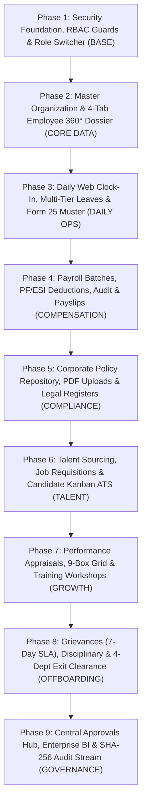
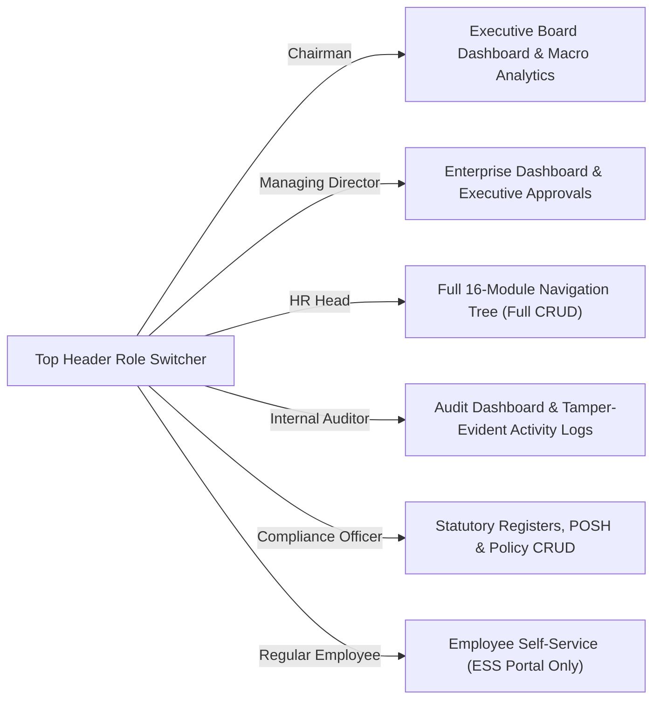
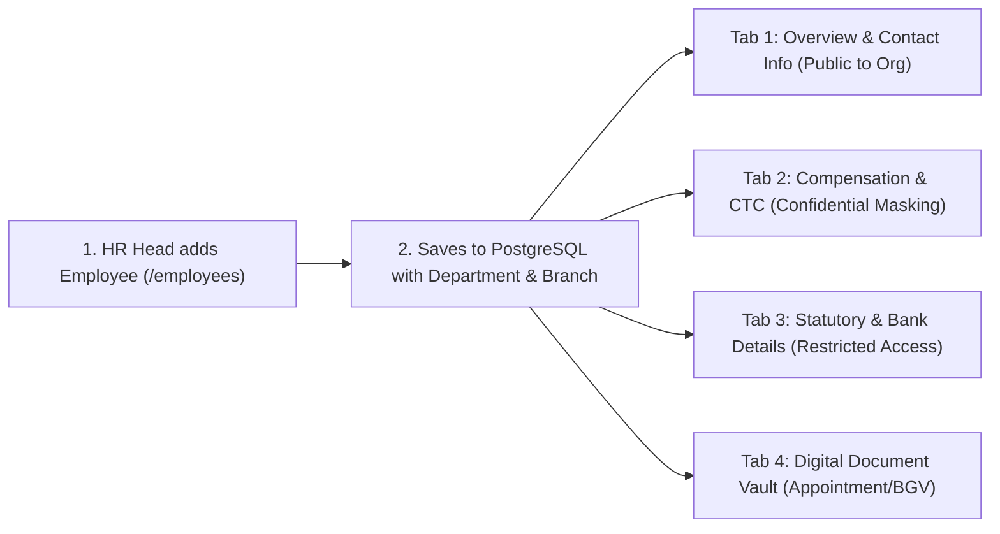
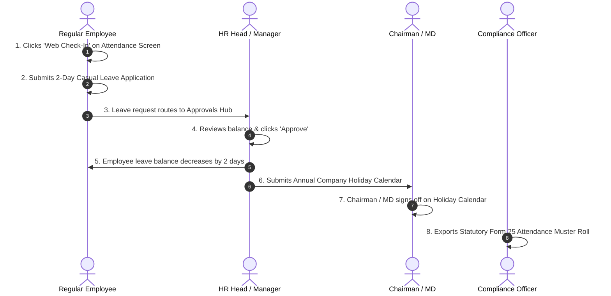
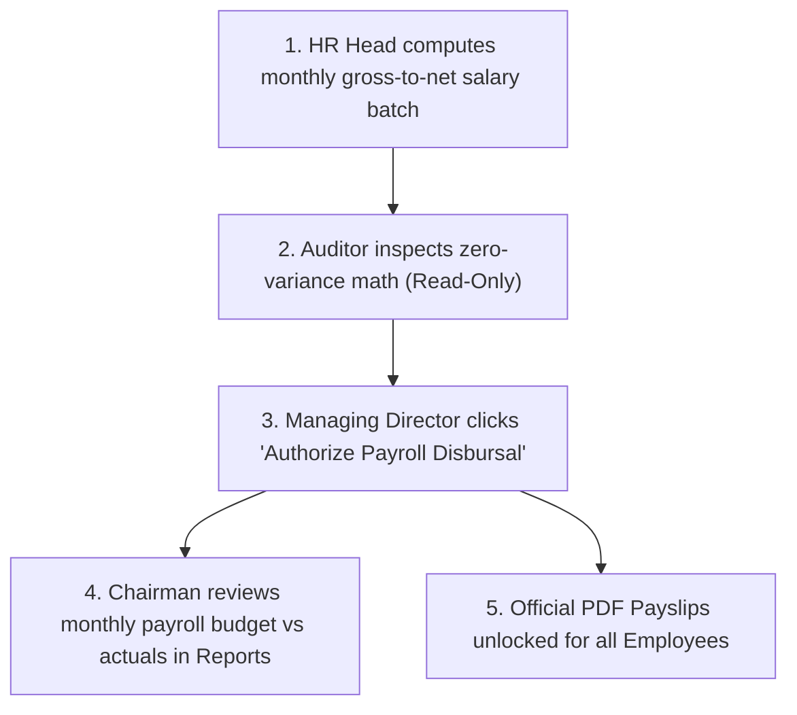
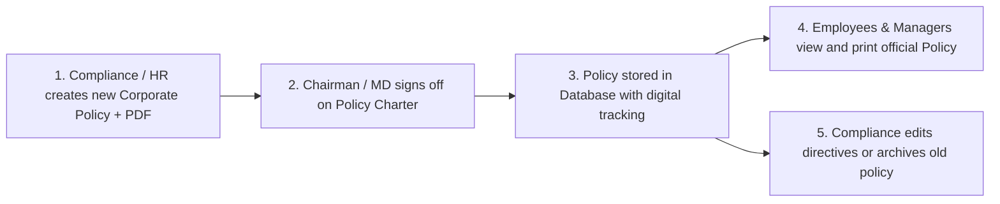
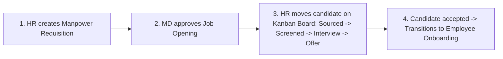
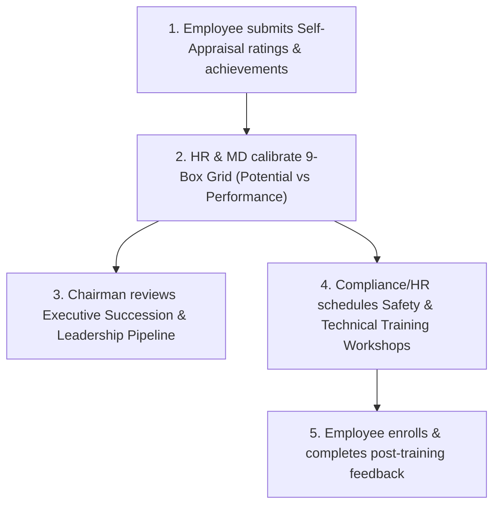
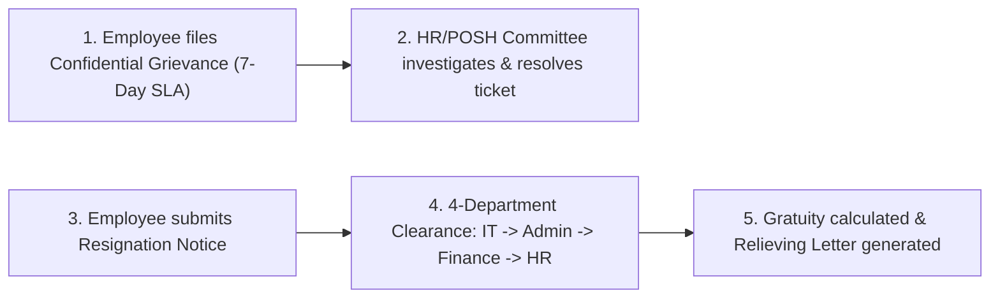
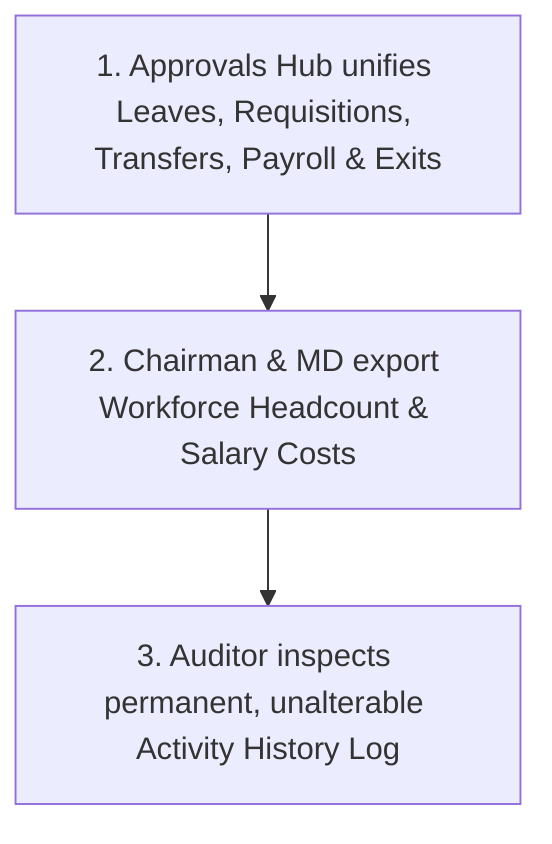

# Viruzverse HRMS — Master Phase-by-Phase Testing, Role Boundary Verification & CRUD Blueprint

> **Document Version**: 4.0 (Comprehensive Execution & QA Blueprint)  
> **Target Audience**: QA Engineers, Full-Stack Developers, HR Administrators, Compliance Auditors, and Business Owners.  
> **Goal**: Step-by-step verification of all 16 screens, complete CRUD operations, strict 6-role RBAC isolation, and relational data integrity.  
> **Applicable For**: Multi-Plant Manufacturing, Healthcare, Retail Chains, Logistics, and Corporate Enterprises.

---

## 1. The 9-Phase Sequential Implementation & Testing Roadmap

We must execute testing following the **natural data dependency chain**:



---

## 2. Master Test Personas & Role Credentials

The system seeds 6 standardized enterprise personas across all operational tiers:

| Persona Name | Role Key (`UserRole`) | Official Email | Linked Employee ID | Department | Scope of Authority |
| :--- | :--- | :--- | :--- | :--- | :--- |
| **Alexander Sterling** | `chairman` | `alexander.sterling@viruzverse.com` | *None (Board)* | Board of Directors | Macro Governance, Policy Charters, Holiday Calendars |
| **Dr. Vikramaditya Rathore**| `managing_director`| `vikram.rathore@viruzverse.com` | `emp_004` | Executive Management | Executive Approvals, Payroll Disbursal, Promotions, Exit Waivers |
| **Eleanor Vance** | `hr_head` | `eleanor.vance@viruzverse.com` | `emp_001` | Human Resources | Master Operational Controller (Full CRUD across all 16 screens) |
| **Marcus Chen** | `internal_audit_head`| `marcus.chen@viruzverse.com` | `emp_003` | Finance & Audit | Independent Read-Only Auditor, Ghost-Worker Audit, SHA-256 Logs |
| **Rajeshwari Nair** | `compliance_statutory`| `rajeshwari.nair@viruzverse.com` | `emp_002` | Legal & Compliance | Full Policy CRUD, PF/ESI/TDS Filings, Form 25 Muster, POSH Head |
| **Vishwadharan R** | `employee` | `vishwadharan.r@viruzverse.com` | `emp_005` | Quality Inspection | Self-Service Portal (Own Clock-In, Leaves, Payslips, Grievances) |

---

## 3. Detailed Phase-by-Phase Testing & CRUD Execution

---

### 🚀 PHASE 1: Security Foundation, RBAC Guards & Role Switcher

* **Objective**: Verify that switching personas in the header immediately re-renders the navigation tree, updates contextual screen permissions, and strictly blocks unauthorized URL paths with HTTP 403 Forbidden.
* **Target Components**: Top Header (`AppHeader.tsx`), Navigation Sidebar (`AppSidebar.tsx`), Screen Guard (`RBACGuard.tsx`).



#### Step-by-Step Test Procedure:
1. Open `http://localhost:3000` in your web browser.
2. Click the **"Role Switcher"** dropdown in the top header.
3. Switch through each of the **6 roles** and verify visible vs. blocked sidebar links:

| Active Role | Visible Navigation Items | Strictly Hidden / Blocked Modules |
| :--- | :--- | :--- |
| **Chairman** | Dashboard (Macro), Approvals Hub (Board items), Analytics & Reports, Employee Directory (View-Only), Policy Repository (Full CRUD), Performance (Executive Reviews), Settings (View-Only). | Routine daily operational tasks (daily punch edits, candidate ATS pipelines, manual shift adjustments). |
| **Managing Director** | Dashboard (Enterprise), Approvals Hub (Full Queue), Analytics & Reports, Employee Directory, Recruitment (Approve), Attendance (Overtime), Leaves (Execs), Payroll (Disbursal), Performance, Movements, Disciplinary, Resignations, Policies, Settings. | None (Executive oversight across all operational modules). |
| **HR Head** | Full 16-module sidebar with full administrative authority (**Full CRUD**). | No modules hidden. |
| **Internal Auditor** | Audit Dashboard, Salary & Statutory Audit, Policy & Rulebook, Disciplinary Inquiries, System Activity Logs, Employee Directory (View-Only). | Recruitment ATS, Performance Scoring, Movements, and all creation/edit buttons are **completely hidden/disabled**. |
| **Compliance Officer** | Compliance Dashboard, Policy & Compliance (Full CRUD), Statutory Filings (PF/ESI), Statutory Muster (Form 25), Statutory Leave Registers, POSH & Welfare Committee, Safety Training, Exit Clearances. | Recruitment ATS, Performance Scoring, and Movements are **completely hidden**. |
| **Regular Employee** | My Profile 360 (Self), Attendance Check-In, My Leaves, My Payslips, My Self-Appraisal, Training Enrollment, Grievance Box, Resignation Notice. | Recruitment, Employee Directory, Company Reports, Approvals Hub, Settings are **completely hidden**. |

4. **URL Tamper & Penetration Test**:
   - While logged in as **Regular Employee**, manually type `http://localhost:3000/recruitment` or `http://localhost:3000/settings` in the address bar.
   - **Verification**: The system must display **"Access Denied (HTTP 403 Forbidden)"** or redirect safely to `/dashboard`.

#### Phase 1 Acceptance Checklist:
- [ ] Header dropdown cleanly switches active session across all 6 personas.
- [ ] Sidebar dynamically morphs menus, badges, and group labels per role.
- [ ] Direct URL entry to restricted screens is strictly blocked by `RBACGuard`.

---

### 🚀 PHASE 2: Organization Master Data & 4-Tab Employee 360° Dossier

* **Objective**: Test creating new personnel, searching directory records, and verifying field-level salary privacy masking across the 4-tab dossier.
* **Target Screens**: Employee Directory (`/employees`), Employee 360° Profile (`/employees/[id]`).



#### Detailed CRUD Operations to Execute:
1. **CREATE (Add New Employee)**:
   - Switch to **Role: HR Head**.
   - Navigate to `/employees` $\rightarrow$ Click **"Add New Employee"** button.
   - Enter: Full Name (*e.g., Rajesh Sharma*), Email (*rajesh.sharma@viruzverse.com*), Department (*Manufacturing Operations*), Designation (*Senior Quality Inspector*), Joining Date, Annual CTC (*₹5,40,000*).
   - Click **"Create Employee"**.
   - **Verification**: Confirm the employee card appears in the directory list.
2. **READ (4-Tab 360° Profile & Privacy Check)**:
   - Click on the new employee to open `/employees/[id]`.
   - Inspect the **4 Core Tabs**:
     * **Overview & Bio**: Personal info, reporting manager, and emergency contacts.
     * **Compensation & CTC**: Annual CTC, monthly gross, estimated take-home pay, basic/HRA breakdown, and PF/ESI/TDS deductions.
     * **Statutory & Bank**: Bank name, account number, IFSC, PAN, UAN, and PF number.
     * **Document Vault**: Official appointment letter, ID proof, and degree certificates.
3. **SALARY PRIVACY MASKING TEST**:
   - Switch to **Role: Regular Employee (Vishwadharan R)** $\rightarrow$ Try to access Rajesh Sharma's profile `/employees/[id]`.
   - **Verification**: Profile is blocked, or if viewing directory, salary amounts are strictly masked as `Confidential`.
4. **UPDATE (Edit Employee Dossier)**:
   - As **HR Head** $\rightarrow$ Click **"Edit Profile"** on employee dossier $\rightarrow$ Update designation or emergency phone $\rightarrow$ Save.
   - **Verification**: Profile reflects updated values immediately.

#### Phase 2 Acceptance Checklist:
- [ ] New employee creation persists to PostgreSQL database with valid foreign keys.
- [ ] Search bar filters personnel by name, employee code, and department.
- [ ] Sensitive salary and bank account numbers are masked from unauthorized roles.
- [ ] Profile renders cleanly with the 4 functional tabs (Overview, Compensation, Statutory, Documents).

---

### 🚀 PHASE 3: Daily Web Clock-In, Multi-Tier Leaves & Statutory Form 25 Muster

* **Objective**: Test daily employee attendance clock-in, leave balance deductions, multi-tier manager approvals, Chairman holiday calendar approvals, and statutory Form 25 muster exports.
* **Target Screens**: Attendance & Shifts (`/attendance`), Leave Management (`/leaves`), Approvals Hub (`/approvals`).



#### Detailed CRUD Operations to Execute:
1. **CREATE (Daily Web Clock-In)**:
   - Switch to **Role: Regular Employee (Vishwadharan R)** $\rightarrow$ Go to `/attendance`.
   - Click **"Web Check-In"** button.
   - **Verification**: Today's status immediately turns green *"Present"* with current timestamp.
2. **CREATE (Submit Leave Application)**:
   - As **Employee** $\rightarrow$ Go to `/leaves` $\rightarrow$ Click **"Apply for Leave"**.
   - Select Leave Type (*Casual Leave*), Duration (*2 Days*), Reason (*Personal commitments*).
   - Click **"Submit Application"**.
   - **Verification**: Available balance decreases (e.g. 12 $\rightarrow$ 10 days), status shows *"Pending Approval"*.
3. **APPROVE (Manager / HR Leave Approval)**:
   - Switch to **Role: HR Head** or **Managing Director** $\rightarrow$ Open `/approvals`.
   - Locate the pending leave request $\rightarrow$ Click **"Approve"**.
   - **Verification**: Status updates to *"Approved"*. Switch to **Employee** and confirm approved status.
4. **APPROVE (Annual Holiday Calendar by Chairman / MD)**:
   - Switch to **Role: Chairman** or **Managing Director** $\rightarrow$ Go to `/leaves` or `/approvals`.
   - Review proposed holiday schedule $\rightarrow$ Authorize annual holiday calendar.
5. **READ & EXPORT (Statutory Form 25 Muster Roll)**:
   - Switch to **Role: Compliance Officer** $\rightarrow$ Go to `/attendance`.
   - Click **"Export Monthly Register (Form 25)"**.
   - **Verification**: System exports the legal monthly attendance muster roll compliant with the Factories Act.

#### Phase 3 Acceptance Checklist:
- [ ] Web Clock-In records live punch timestamps in real time.
- [ ] Leave application enforces balance validation and deducts days accurately.
- [ ] Approvals Hub updates leave status across sessions immediately.
- [ ] Chairman / MD can review and authorize annual holiday calendars.
- [ ] Compliance Officer can export official Form 25 Attendance Muster Roll.

---

### 🚀 PHASE 4: Monthly Payroll Batches, PF/ESI Dues & Printable Payslips

* **Objective**: Test gross-to-net salary calculations, statutory deductions (Provident Fund, ESI, Tax withholding), executive disbursal sign-off, and employee payslip printing.
* **Target Screens**: Payroll & Benefits (`/payroll`), Approvals Hub (`/approvals`), Company Reports (`/reports`).



#### Detailed CRUD Operations to Execute:
1. **READ & PROCESS (Monthly Payroll Calculation)**:
   - Switch to **Role: HR Head** $\rightarrow$ Go to `/payroll`.
   - Review the wage table: Base Pay, House Rent Allowance (HRA), Special Allowance, Gross Earnings.
   - Verify statutory deductions:
     * **EPF (Provident Fund)**: 12% employee deduction.
     * **ESIC (State Insurance)**: 0.75% deduction for applicable brackets.
     * **TDS / Tax Withholding**: Applicable tax deduction.
     * **Net Payable Salary**: (Gross Pay − Total Deductions).
2. **AUDIT (Forensic Zero-Variance Inspection)**:
   - Switch to **Role: Internal Auditor** $\rightarrow$ Go to `/payroll`.
   - **Verification**: Screen displays in **Audit Mode (Read-Only)** with no edit or delete buttons.
   - Verify gross earnings match bank disbursement totals with zero variance.
3. **APPROVE (Executive Disbursal Authorization)**:
   - Switch to **Role: Managing Director** $\rightarrow$ Go to `/payroll` or `/approvals`.
   - Click **"Authorize Payroll Disbursal"**.
   - **Verification**: Batch transitions from *"Pending Review"* $\rightarrow$ *"Disbursed"*.
4. **BOARD REVIEW (Chairman Macro Compensation Report)**:
   - Switch to **Role: Chairman** $\rightarrow$ Go to `/reports`.
   - Review total monthly payroll cost, overtime trends, and department compensation breakdown.
5. **READ & PRINT (Employee Official Payslip)**:
   - Switch to **Role: Regular Employee (Vishwadharan R)** $\rightarrow$ Go to `/payroll`.
   - Click **"View Payslip"** on the latest salary cycle.
   - **Verification**: Official payslip modal opens displaying company seal, earnings, deductions, and net salary. Click **"Print Payslip"** to verify print preview.

#### Phase 4 Acceptance Checklist:
- [ ] Gross-to-Net salary calculations compute accurately with standard formulas.
- [ ] PF (12%), ESI (0.75%), and tax deductions align with statutory standards.
- [ ] Auditor can inspect salary records in read-only mode without edit buttons.
- [ ] Managing Director authorization releases official PDF payslips to employees.
- [ ] Chairman can review macro compensation analytics.

---

### 🚀 PHASE 5: Corporate Policy Repository, PDF Uploads & Statutory Registers

* **Objective**: Test full CRUD operations (Create, Read, Update, Delete) on company policies, upload signed PDF directives, track workforce digital acknowledgments, and test Chairman governance sign-off.
* **Target Screens**: Policy & Statutory Compliance (`/compliance`).



#### Detailed CRUD Operations to Execute:
1. **CREATE (Publish New Corporate Policy)**:
   - Switch to **Role: Compliance Officer**, **HR Head**, or **Chairman** $\rightarrow$ Go to `/compliance`.
   - Click **"Publish Policy Document"** button.
   - Fill in: Title (*Plant Safety & EHS Guidelines v2.1*), Category (*Safety EHS*), Effective Date, Directives text, and attach PDF.
   - Click **"Publish Policy"**.
   - **Verification**: New policy card appears immediately in the active policy list.
2. **READ (View & Print Official Policy)**:
   - Click **"View / PDF"** on the published policy.
   - **Verification**: Official policy document modal opens with letterhead, metadata grid, and print button.
3. **UPDATE (Edit Policy Details)**:
   - Click the **Pencil (Edit)** icon on an existing policy card $\rightarrow$ Update version or directives $\rightarrow$ Save.
   - **Verification**: Policy card updates with new content.
4. **DELETE (Archive Obsolete Policy)**:
   - Click the **Trash (Delete)** icon on a test policy $\rightarrow$ Confirm deletion.
   - **Verification**: Policy is removed from active repository.

#### Phase 5 Acceptance Checklist:
- [ ] Chairman, Compliance Officer & HR Head have Full CRUD access to policies.
- [ ] Signed PDF document upload and viewing works smoothly.
- [ ] Search bar and category filters (POSH, Safety EHS, Code of Conduct) filter cards in real time.
- [ ] Regular employees cannot edit or delete corporate policies.

---

### 🚀 PHASE 6: Talent Sourcing, Job Requisitions & Candidate ATS Pipeline

* **Objective**: Test creating manpower requisitions, approving job openings, advancing candidates across the visual Kanban hiring board, and issuing offers.
* **Target Screens**: Recruitment & Pipeline (`/recruitment`), Approvals Hub (`/approvals`).



#### Detailed CRUD Operations to Execute:
1. **CREATE (Manpower Job Requisition)**:
   - Switch to **Role: HR Head** $\rightarrow$ Go to `/recruitment`.
   - Click **"Create Job Requisition"** $\rightarrow$ Job Title (*Automation Engineer*), Department (*Engineering*), Positions (*2*), Target Date $\rightarrow$ Submit.
2. **APPROVE (Hiring Clearance)**:
   - Switch to **Role: Managing Director** $\rightarrow$ Go to `/approvals` or `/recruitment` $\rightarrow$ Approve the requisition.
3. **UPDATE (Candidate Pipeline Kanban Progression)**:
   - As **HR Head** $\rightarrow$ On the Candidate Kanban Board, move a candidate card across stages:
     $$\text{Sourced} \longrightarrow \text{Screened} \longrightarrow \text{Interview Scheduled} \longrightarrow \text{Offer Letter Issued} \longrightarrow \text{Joined}$$
   - **Verification**: Candidate card stage updates in the database in real time.
4. **ACCESS GUARD CHECK**:
   - Switch to **Employee**, **Compliance Officer**, or **Internal Auditor**.
   - **Verification**: Recruitment ATS is completely hidden from their sidebar to protect candidate privacy.

#### Phase 6 Acceptance Checklist:
- [ ] Manpower job requisitions require executive approval.
- [ ] Candidate Kanban board moves applicants across hiring stages smoothly.
- [ ] Recruitment module is strictly hidden for unauthorized roles.

---

### 🚀 PHASE 7: Performance Reviews, 9-Box Grid & Training Programs

* **Objective**: Test employee self-appraisal submissions, manager 9-box talent rating calibrations, Chairman executive succession reviews, and scheduling safety/skills training workshops.
* **Target Screens**: Performance & KRAs (`/performance`), Training & Skills (`/training`).



#### Detailed CRUD Operations to Execute:
1. **CREATE (Employee Self-Appraisal)**:
   - Switch to **Role: Regular Employee (Vishwadharan R)** $\rightarrow$ Go to `/performance`.
   - Fill out rating stars (1 to 5) and write key achievements $\rightarrow$ Click **"Submit Self-Appraisal"**.
   - **Verification**: Self-appraisal score saves to the employee's dossier.
2. **READ & REVIEW (9-Box Grid Talent Matrix)**:
   - Switch to **Role: HR Head**, **Managing Director**, or **Chairman** $\rightarrow$ Go to `/performance`.
   - Inspect the interactive **9-Box Talent Matrix** (High Potential vs. High Performance).
   - **Verification**: Employee cards plot accurately into leadership boxes (*Core Talent, High Potential, Top Star*).
3. **CREATE & ENROLL (Training Workshop)**:
   - Switch to **Role: Compliance Officer** or **HR Head** $\rightarrow$ Go to `/training`.
   - Click **"Schedule Workshop"** $\rightarrow$ Title (*Factory Chemical Safety & Spill Response*), Capacity (*25*), Date $\rightarrow$ Save.
   - Switch to **Role: Regular Employee** $\rightarrow$ Go to `/training` $\rightarrow$ Click **"Enroll in Workshop"**.
   - **Verification**: Enrollment count increases from 0 $\rightarrow$ 1.

#### Phase 7 Acceptance Checklist:
- [ ] Employee self-appraisals save properly to database.
- [ ] 9-Box Grid categorizes workforce performance accurately.
- [ ] Chairman can review leadership succession pipeline.
- [ ] Training workshops track capacity, enrollments, and feedback ratings.

---

### 🚀 PHASE 8: Grievances (7-Day SLA), Disciplinary Cases & 4-Stage Exits

* **Objective**: Test confidential complaint filing with automatic 7-day timers, misconduct investigations, and multi-departmental no-dues exit clearances.
* **Target Screens**: Welfare & Grievances (`/engagement`), Disciplinary Records (`/disciplinary`), Resignation & Exit (`/resignation`).



#### Detailed CRUD Operations to Execute:
1. **CREATE (Confidential Grievance Ticket)**:
   - Switch to **Role: Regular Employee** $\rightarrow$ Go to `/engagement` $\rightarrow$ Click **"Submit Grievance"**.
   - Select Category (*Workplace Facilities / POSH concern*), enter description $\rightarrow$ Submit.
   - **Verification**: Ticket generates with an **automatic 7-day resolution countdown timer**.
2. **UPDATE (Resolve Grievance)**:
   - Switch to **Role: HR Head** or **Compliance Officer** $\rightarrow$ Open ticket $\rightarrow$ Add investigation notes $\rightarrow$ Click **"Mark as Resolved"**.
3. **CREATE & CLEAR (4-Department Resignation Clearance)**:
   - Switch to **Role: Regular Employee** $\rightarrow$ Go to `/resignation` $\rightarrow$ Submit resignation letter with requested Last Working Day (LWD).
   - Switch to **Role: HR Head / Compliance Officer** $\rightarrow$ Open the resignation record.
   - Verify the 4-stage clearance checklist:
     * **IT Department**: Laptop & software accounts returned.
     * **Admin Department**: ID badge & parking pass returned.
     * **Finance Department**: Travel advances and loan dues cleared.
     * **HR / Statutory**: Gratuity eligibility calculated and PF transfer forms signed.
   - Click **"Generate Relieving & Experience Letter"**.

#### Phase 8 Acceptance Checklist:
- [ ] Grievance tickets enforce 7-day resolution timer.
- [ ] Disciplinary cases document inquiry findings and official sanctions.
- [ ] 4-department exit clearances calculate gratuity and produce official relieving letters.

---

### 🚀 PHASE 9: Approvals Hub, Executive Reports & SHA-256 Activity Logs

* **Objective**: Verify centralized multi-category approvals, cross-department analytics exports for Chairman & MD, and audit the permanent activity log stream.
* **Target Screens**: Approvals Hub (`/approvals`), Company Reports (`/reports`), System Settings & Activity Logs (`/settings`).



#### Detailed CRUD Operations to Execute:
1. **CENTRALIZED APPROVALS QUEUE**:
   - Switch to **Role: Chairman**, **Managing Director**, or **HR Head** $\rightarrow$ Open `/approvals`.
   - Verify tabs for all 7 approval categories: *Leaves, Job Requisitions, Transfers, Payroll Runs, Resignations, Holidays, Disciplinary*.
2. **EXECUTIVE ANALYTICS & REPORTS**:
   - Switch to **Role: Chairman** or **Managing Director** $\rightarrow$ Open `/reports`.
   - Generate reports for: *Workforce Headcount Distribution, Salary Cost Breakdown, Department Attrition Rates, Overtime Hours*.
3. **PERMANENT ACTIVITY HISTORY LOG STREAM**:
   - Switch to **Role: Internal Auditor** $\rightarrow$ Go to `/settings` $\rightarrow$ Open the **"System Activity Logs"** tab.
   - Search by user or module.
   - **Verification**: Confirm every action executed during Phases 1 through 8 is recorded with exact timestamp, user name, role, and action type. Confirm that standard users **cannot edit or delete past activity logs**.

#### Phase 9 Acceptance Checklist:
- [ ] Approvals Hub routes all 7 workflow categories accurately.
- [ ] Chairman & MD can approve high-level governance and operational items.
- [ ] Reports export clean workforce and financial summaries.
- [ ] System Activity Logs permanently record all actions with SHA-256 hashes without deletion capability.

---

## 4. Role Isolation Negative Testing Matrix

Execute these negative test cases to ensure no role can perform another role's tasks:

| Test Case ID | Persona Tested | Attempted Action | Expected Result | Pass / Fail |
| :--- | :--- | :--- | :--- | :---: |
| **NEG-01** | `internal_audit_head` | Attempt to edit employee salary or create a new user in `/payroll` or `/employees` | **Blocked**: Screen is in Read-Only Audit Mode with no edit/create buttons. | [ ] |
| **NEG-02** | `compliance_statutory`| Attempt to score performance appraisals or access recruitment pipeline | **Blocked**: Modules are completely hidden and direct URL access returns HTTP 403. | [ ] |
| **NEG-03** | `employee` | Attempt to open another worker's profile URL or access `/approvals` | **Blocked**: Direct URL returns HTTP 403; salary fields are strictly masked. | [ ] |
| **NEG-04** | `chairman` | Attempt to edit daily shift punch minutes or process individual payslips | **Blocked**: Operational edit tools are disabled/hidden. | [ ] |
| **NEG-05** | `hr_head` | Attempt to disburse payroll without MD signoff | **Blocked**: Button requires MD executive authority. | [ ] |

---

## 5. Quick Verification Terminal Commands

Run these terminal commands in your project root to ensure system health before and after testing:

```bash
# 1. Verify TypeScript compilation (0 errors required)
npx tsc --noEmit

# 2. Synchronize database schema with PostgreSQL
npm run db:push

# 3. Seed master organization, personas, and records
npm run db:seed

# 4. Start Next.js development server
npm run dev
```

---
*End of Master Phase-by-Phase Testing & Execution Blueprint — Viruzverse HRMS v4.0.*
