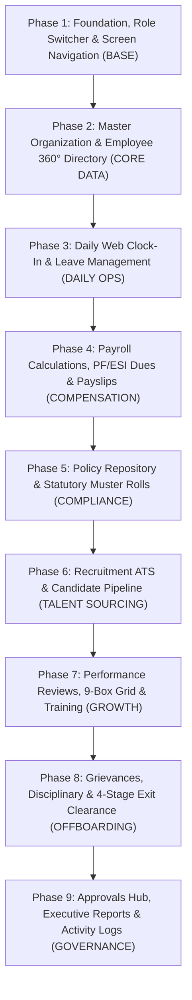
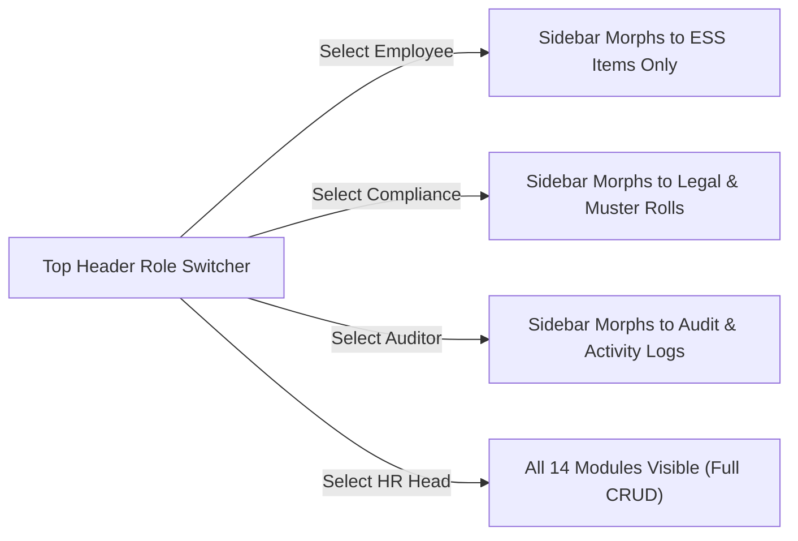
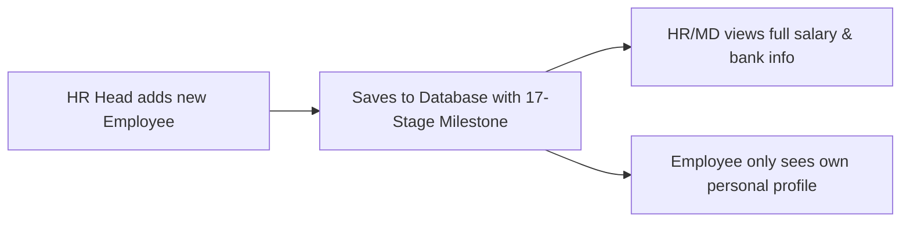
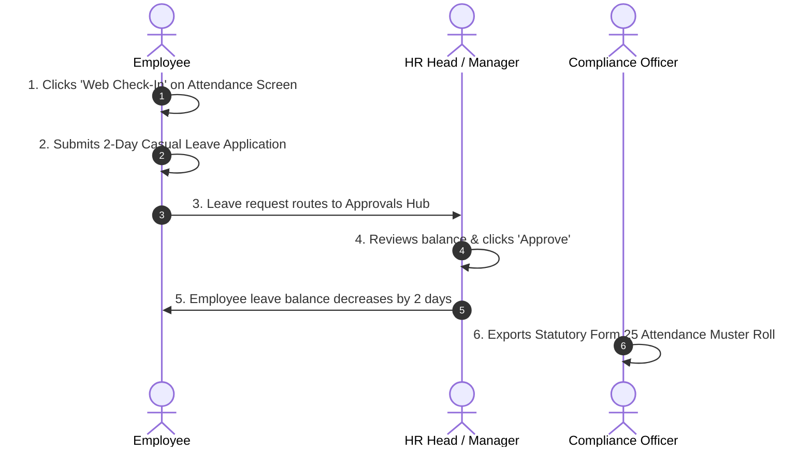
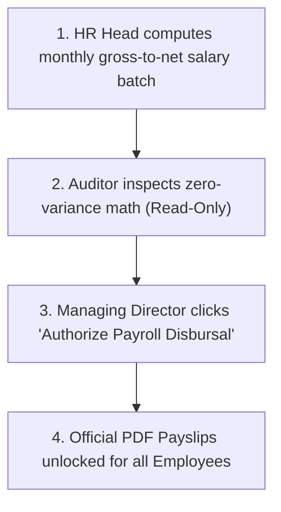
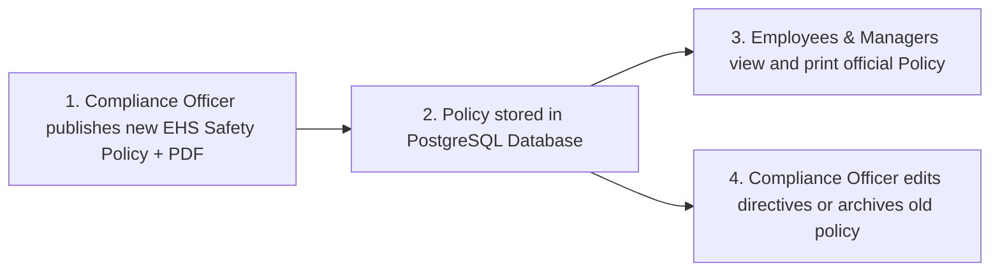
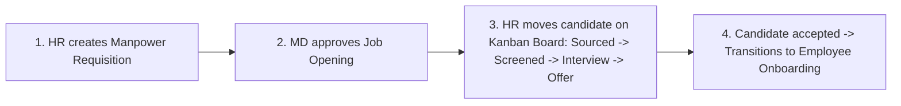
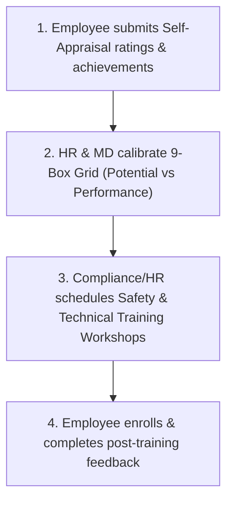
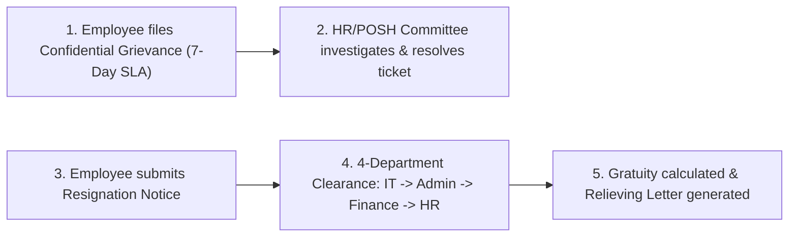
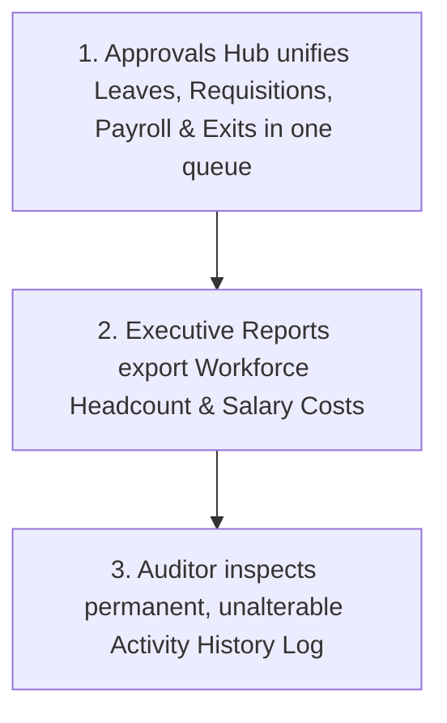

# Viruzverse HRMS — Phase-by-Phase Implementation & CRUD Testing Guide

> **Document Name**: Master Phase-by-Phase Testing & Execution Blueprint  
> **Target Audience**: QA Testers, Developers, HR Administrators, and Business Owners.  
> **Goal**: Step-by-step verification of all 16 screens, complete CRUD operations, and strict 6-role RBAC permissions.  
> **Applicable For**: Any enterprise (Factories & Manufacturing, Hospitals, Retail Chains, Logistics, Corporate Offices, and IT).  

---

## 1. Which Phase is Best to Start Off? (The Logical Roadmap)

### Recommended Starting Sequence:
We must follow the **natural employee lifecycle** and **data dependency chain**:



### Why Start with Phase 1 & Phase 2?
1. **Phase 1 (Security & Navigation)**: Before testing business features, we must verify that the 6 roles switch cleanly and unauthorized pages are blocked.
2. **Phase 2 (Employee Master Data)**: Every other module (Attendance, Leaves, Payroll, Performance, Grievances, Exits) requires active employee records. Creating employees first ensures all downstream modules have real data to process.

---

## 2. Master Summary: 6 Roles & Their Permission Keys

| Role Key | Plain-Language Title | Allowed Capabilities |
| :--- | :--- | :--- |
| **`chairman`** | **Chairman of the Board** | High-level business view, board-level executive approvals, macro salary reports. |
| **`managing_director`** | **Managing Director / CEO** | Final business authority; approves payroll disbursal, new hires, promotions, and major penalties. |
| **`hr_head`** | **HR Head / Director** | Master operational control (**Full CRUD**) across all 14 modules and 17 lifecycle stages. |
| **`internal_audit_head`** | **Internal Auditor** | Independent checker (**View-Only Audit**); inspects salary math and permanent activity history. |
| **`compliance_statutory`**| **Compliance Officer** | Legal guardian (**Full CRUD on Policies**); handles PF/ESI/TDS filings, Form 25 muster rolls, and POSH committee. |
| **`employee`** | **Regular Employee** | Self-Service Portal (**Own Record Only**); clock-in, leave application, payslips, grievances. |

---

## 3. Detailed Phase-by-Phase Testing & CRUD Execution

---

### 🚀 PHASE 1: Security Foundation, Role Switcher & Navigation Morphing

* **Objective**: Confirm that switching roles in the header instantly updates the sidebar menus, changes titles, and blocks unauthorized URL access.
* **Target Components**: Top Header (`AppHeader.tsx`), Navigation Sidebar (`AppSidebar.tsx`), Screen Guard (`RBACGuard.tsx`).



#### Step-by-Step Test Procedure:
1. Open `http://localhost:3000` in your web browser.
2. Click the **"Role" dropdown** in the top header.
3. Switch through each of the 6 roles and verify the sidebar navigation:

| Switch to Role | Expected Sidebar Titles & Visible Items | Expected Blocked / Hidden Items |
| :--- | :--- | :--- |
| **Employee** (`employee`) | Profile 360, Attendance Check-In, Leave Requests, Payslips, Self-Appraisals, Training Enrolment, Grievance Filing, Resignation Notice. | Recruitment, Employee Directory, Settings, Reports, Approvals Hub are **completely hidden**. |
| **Compliance Officer** (`compliance_statutory`) | Compliance Dashboard, Policy & Statutory Compliance, Statutory Filings (PF/ESI), Statutory Muster (Form 25), Statutory Leave Registers, POSH & Welfare Committee, Safety & EHS Training, Exit Clearances & Gratuity. | Recruitment, Performance KRAs, Promotions are **completely hidden**. |
| **Internal Auditor** (`internal_audit_head`) | Audit Dashboard, Salary & Statutory Audit, Policy & Rulebook, Disciplinary & Inquiries, System Activity Logs, Employee Directory (View-Only). | Recruitment, Performance KRAs, Promotions, and all creation/edit buttons are **hidden/disabled**. |
| **Managing Director** (`managing_director`) | Executive Dashboard, Approvals Hub, Enterprise Analytics, Master Directory, ATS Approvals, Payroll Disbursal, Performance Calibrations, Transfers, Disciplinary. | Full executive visibility across all management modules. |
| **HR Head** (`hr_head`) | Full 14-module sidebar with full administrative control. | No modules hidden. |

4. **URL Tamper Test**:
   - While logged in as **Employee**, manually type `http://localhost:3000/recruitment` or `http://localhost:3000/settings` in your browser address bar.
   - **Verification**: The system must display **"Access Denied (HTTP 403)"** or redirect safely.

#### Phase 1 Verification Checklist:
- [ ] Role switcher dropdown in header switches active user session cleanly.
- [ ] Sidebar menus adapt titles and visible links dynamically per role.
- [ ] Direct URL entry to restricted screens is strictly blocked by `RBACGuard`.

---

### 🚀 PHASE 2: Organization Master Data & Employee 360° Directory

* **Objective**: Test creating new employees, editing profile dossiers, searching directory records, and verifying salary privacy masking.
* **Target Screens**: Employee Directory (`/employees`), Employee 360 Profile (`/employees/[id]`).



#### Detailed CRUD Operations to Execute:
1. **CREATE (Add Employee)**:
   - Switch to **Role: HR Head**.
   - Go to `/employees` $\rightarrow$ Click **"Add New Employee"** button.
   - Fill in: Full Name (*e.g., Ramesh Patel*), Email (*ramesh.patel@viruzverse.com*), Department (*Manufacturing & Plant Operations*), Designation (*Senior Quality Inspector*), Joining Date, Base Salary (*₹45,000/mo*).
   - Click **"Create Employee"**.
   - **Verification**: Confirm the new employee card appears in the directory list.
2. **READ (Profile 360 & Salary Privacy Check)**:
   - Click on the newly created employee to open `/employees/[id]`.
   - As **HR Head / MD**: Verify you can see full compensation, bank account number, and documents.
   - Switch to **Employee (Vishwadharan R)**: Try to open Ramesh Patel's profile URL directly.
   - **Verification**: The system must block access or redirect you to your own personal profile.
3. **UPDATE (Edit Employee Details)**:
   - As **HR Head**: Open employee dossier $\rightarrow$ Click **"Edit Profile"** $\rightarrow$ Change designation to *"Lead Quality Auditor"* $\rightarrow$ Save.
   - **Verification**: Profile updates immediately with the new designation.
4. **17-STAGE LIFECYCLE PROGRESSION**:
   - Look at the **Lifecycle Milestone Bar** at the top of the employee dossier.
   - Verify it displays current status (*Joining* $\rightarrow$ *Probation* $\rightarrow$ *Active Service*).

#### Phase 2 Verification Checklist:
- [ ] New employee creation persists to PostgreSQL database.
- [ ] Search bar filters workers by name, employee code, and department.
- [ ] Sensitive salary and bank account numbers are hidden from unauthorized roles.
- [ ] 17-stage career milestone progress bar reflects accurate employee state.

---

### 🚀 PHASE 3: Daily Web Clock-In, Attendance Muster & Leave Approvals

* **Objective**: Test daily employee attendance clock-in, leave balance deductions, multi-tier manager approvals, and statutory Form 25 muster exports.
* **Target Screens**: Attendance & Shifts (`/attendance`), Leave Management (`/leaves`), Approvals Hub (`/approvals`).



#### Detailed CRUD Operations to Execute:
1. **CREATE (Daily Web Clock-In)**:
   - Switch to **Role: Employee (Vishwadharan R)**.
   - Go to `/attendance` $\rightarrow$ Click **"Web Check-In"** button.
   - **Verification**: Today's status immediately turns green *"Present"* with the current punch-in timestamp.
2. **CREATE (Submit Leave Application)**:
   - As **Employee** $\rightarrow$ Go to `/leaves` $\rightarrow$ Click **"Apply for Leave"**.
   - Select Leave Type (*Casual Leave*), Duration (*2 Days: Tomorrow to Day-after*), Reason (*Family function*).
   - Click **"Submit Application"**.
   - **Verification**: Available leave balance decreases from 12 $\rightarrow$ 10 days, and request status shows *"Pending Approval"*.
3. **APPROVE (Manager / HR Approval Workflow)**:
   - Switch to **Role: HR Head** or **Managing Director**.
   - Go to `/approvals` $\rightarrow$ Look at the **Leave Requests** queue.
   - Locate Vishwadharan's 2-day leave application.
   - Click **"Approve"** (or test "Reject" with a reason note).
   - **Verification**: Status turns green *"Approved"*. Switch back to **Employee** and confirm the leave status displays as *"Approved"*.
4. **READ & EXPORT (Statutory Form 25 Muster Roll)**:
   - Switch to **Role: Compliance Officer**.
   - Go to `/attendance` $\rightarrow$ Click **"Export Monthly Register (Form 25)"**.
   - **Verification**: System exports the legal monthly attendance muster roll compliant with the Factories Act.

#### Phase 3 Verification Checklist:
- [ ] Web Clock-In updates attendance logs in real time.
- [ ] Leave application prevents applying for more days than available balance.
- [ ] Approvals Hub updates leave status immediately across all user sessions.
- [ ] Compliance Officer can export official Form 25 Attendance Muster Roll.

---

### 🚀 PHASE 4: Monthly Payroll Batches, PF/ESI Dues & Printable Payslips

* **Objective**: Test gross-to-net salary calculations, statutory government deductions (Provident Fund, ESI, Tax withholding), executive disbursal sign-off, and employee payslip printing.
* **Target Screens**: Payroll & Benefits (`/payroll`), Approvals Hub (`/approvals`).



#### Detailed CRUD Operations to Execute:
1. **READ & PROCESS (Monthly Payroll Calculation)**:
   - Switch to **Role: HR Head** $\rightarrow$ Go to `/payroll`.
   - Review the wage table: Base Pay, House Rent Allowance (HRA), Special Allowance, Gross Earnings.
   - Check statutory deduction columns:
     - **EPF (Provident Fund)**: 12% employee deduction.
     - **ESIC (State Insurance)**: 0.75% deduction for applicable wage brackets.
     - **TDS / Tax Withholding**: Income tax deduction.
     - **Net Payable Salary**: (Gross Pay − Total Deductions).
2. **AUDIT (Forensic Zero-Variance Inspection)**:
   - Switch to **Role: Internal Auditor** $\rightarrow$ Go to `/payroll`.
   - **Verification**: Screen displays in **Audit Mode (Read-Only)**. Confirm there are no accidental edit or delete buttons.
   - Verify that total gross salary matches bank disbursal figures with zero discrepancy.
3. **APPROVE (Executive Disbursal Authorization)**:
   - Switch to **Role: Managing Director** $\rightarrow$ Go to `/payroll` or `/approvals`.
   - Review the batch total $\rightarrow$ Click **"Authorize Payroll Disbursal"**.
   - **Verification**: Batch status changes from *"Pending Review"* $\rightarrow$ *"Disbursed"*.
4. **READ & PRINT (Employee Official Payslip)**:
   - Switch to **Role: Employee (Vishwadharan R)** $\rightarrow$ Go to `/payroll`.
   - Click **"View Payslip"** on the latest salary month.
   - **Verification**: Payslip modal opens displaying company seal, earnings table, deductions table, and net salary. Click **"Print Payslip"** to verify print preview formatting.

#### Phase 4 Verification Checklist:
- [ ] Gross-to-Net salary calculations compute accurately.
- [ ] PF (12%), ESI (0.75%), and tax deductions align with statutory standards.
- [ ] Auditor can inspect salary records in read-only mode without edit buttons.
- [ ] Managing Director authorization releases official PDF payslips to employees.

---

### 🚀 PHASE 5: Policy Repository, Statutory Registers & Signed PDF Uploads

* **Objective**: Test full CRUD operations (Create, Read, Update, Delete) on company policies, upload signed PDF directives, and track workforce digital acknowledgments.
* **Target Screens**: Policy & Statutory Compliance (`/compliance`).



#### Detailed CRUD Operations to Execute:
1. **CREATE (Publish New Corporate Policy)**:
   - Switch to **Role: Compliance Officer** or **HR Head** $\rightarrow$ Go to `/compliance`.
   - Click **"Publish Policy Document"** button.
   - Fill in:
     - **Title**: *Occupational Health, Plant Safety & EHS Guidelines v2.1*
     - **Category**: *Plant Safety (EHS)*
     - **Version**: *v2.1*
     - **Effective Date**: *Today's Date*
     - **Directives / Content**: *Mandatory helmet, safety shoe, and goggles protocol on factory floor.*
     - **Attach PDF**: Upload a sample PDF or document.
   - Click **"Publish Policy"**.
   - **Verification**: New policy card appears immediately in the active policy list.
2. **READ (View & Print Official Policy)**:
   - Click **"View / PDF"** on the newly published policy.
   - **Verification**: Official policy document modal opens with company letterhead, metadata grid, directives text, and a **"Print Document"** button.
3. **UPDATE (Edit Policy Details)**:
   - Click the **Pencil (Edit)** icon on an existing policy card.
   - Change version to *v2.2* and update policy text $\rightarrow$ Click **"Save Policy Changes"**.
   - **Verification**: Policy card updates with new version and content.
4. **DELETE (Archive Obsolete Policy)**:
   - Click the **Trash (Delete)** icon on a test policy $\rightarrow$ Confirm deletion modal.
   - **Verification**: Policy is removed from the active database repository.
5. **READ STATUTORY REGISTERS**:
   - Click **"Export Wage Sheet (Form B)"** and **"View Committee Constitution"** (POSH).
   - **Verification**: Official register cards export and display statutory compliance records.

#### Phase 5 Verification Checklist:
- [ ] Compliance Officer & HR Head have Full CRUD access to policies.
- [ ] Signed PDF document upload and viewing works smoothly.
- [ ] Search bar and category filter (POSH, Safety EHS, Code of Conduct) filter cards in real time.
- [ ] Regular employees cannot edit or delete corporate policies.

---

### 🚀 PHASE 6: Talent Sourcing, Job Requisitions & Candidate ATS Pipeline

* **Objective**: Test creating manpower requisitions, approving job openings, advancing candidates across the visual Kanban hiring board, and issuing offers.
* **Target Screens**: Recruitment & Pipeline (`/recruitment`), Approvals Hub (`/approvals`).



#### Detailed CRUD Operations to Execute:
1. **CREATE (Manpower Job Requisition)**:
   - Switch to **Role: HR Head** $\rightarrow$ Go to `/recruitment`.
   - Click **"Create Job Requisition"** $\rightarrow$ Job Title (*Automation Engineer*), Department (*Engineering*), Positions (*2*), Target Date $\rightarrow$ Submit.
2. **APPROVE (Hiring Clearance)**:
   - Switch to **Role: Managing Director** $\rightarrow$ Go to `/approvals` or `/recruitment` $\rightarrow$ Approve the requisition.
3. **UPDATE (Candidate Pipeline Kanban Progression)**:
   - As **HR Head** $\rightarrow$ On the Candidate Kanban Board, move a candidate card (*e.g., Sunita Rao*) across stages:
     $$\text{Sourced} \longrightarrow \text{Screened} \longrightarrow \text{Interview Scheduled} \longrightarrow \text{Offer Letter Issued} \longrightarrow \text{Joined}$$
   - **Verification**: Candidate card stage updates in the database in real time.
4. **ACCESS GUARD CHECK**:
   - Switch to **Employee**, **Compliance Officer**, or **Internal Auditor**.
   - **Verification**: Recruitment ATS is completely hidden from their sidebar to protect candidate privacy.

#### Phase 6 Verification Checklist:
- [ ] Manpower job requisitions require executive approval.
- [ ] Candidate Kanban board moves applicants across hiring stages smoothly.
- [ ] Recruitment module is strictly hidden for unauthorized roles.

---

### 🚀 PHASE 7: Performance Reviews, 9-Box Grid & Training Programs

* **Objective**: Test employee self-appraisal submissions, manager 9-box talent rating calibrations, and scheduling safety/skills training workshops.
* **Target Screens**: Performance & KRAs (`/performance`), Training & Skills (`/training`).



#### Detailed CRUD Operations to Execute:
1. **CREATE (Employee Self-Appraisal)**:
   - Switch to **Role: Employee (Vishwadharan R)** $\rightarrow$ Go to `/performance`.
   - Fill out rating stars (1 to 5) and write key achievements $\rightarrow$ Click **"Submit Self-Appraisal"**.
   - **Verification**: Self-appraisal score saves to the employee's dossier.
2. **READ & REVIEW (9-Box Grid Talent Matrix)**:
   - Switch to **Role: HR Head** or **Managing Director** $\rightarrow$ Go to `/performance`.
   - Inspect the interactive **9-Box Talent Matrix** (High Potential vs. High Performance).
   - **Verification**: Employee cards plot accurately into leadership boxes (*Core Talent, High Potential, Top Star*).
3. **CREATE & ENROLL (Training Workshop)**:
   - Switch to **Role: Compliance Officer** or **HR Head** $\rightarrow$ Go to `/training`.
   - Click **"Schedule Workshop"** $\rightarrow$ Title (*Factory Chemical Safety & Spill Response*), Capacity (*25*), Date $\rightarrow$ Save.
   - Switch to **Role: Employee** $\rightarrow$ Go to `/training` $\rightarrow$ Click **"Enroll in Workshop"**.
   - **Verification**: Enrollment count increases from 0 $\rightarrow$ 1.

#### Phase 7 Verification Checklist:
- [ ] Employee self-appraisals save properly to database.
- [ ] 9-Box Grid categorizes workforce performance accurately.
- [ ] Training workshops track capacity, enrollments, and feedback ratings.

---

### 🚀 PHASE 8: Grievances (7-Day SLA), Disciplinary Cases & 4-Stage Exits

* **Objective**: Test confidential complaint filing with automatic 7-day timers, misconduct investigations, and multi-departmental no-dues exit clearances.
* **Target Screens**: Welfare & Grievances (`/engagement`), Disciplinary Records (`/disciplinary`), Resignation & Exit (`/resignation`).



#### Detailed CRUD Operations to Execute:
1. **CREATE (Confidential Grievance Ticket)**:
   - Switch to **Role: Employee** $\rightarrow$ Go to `/engagement` $\rightarrow$ Click **"Submit Grievance"**.
   - Select Category (*Workplace Facilities / POSH concern*), enter description $\rightarrow$ Submit.
   - **Verification**: Ticket generates with an **automatic 7-day resolution countdown timer**.
2. **UPDATE (Resolve Grievance)**:
   - Switch to **Role: HR Head** or **Compliance Officer** $\rightarrow$ Open ticket $\rightarrow$ Add investigation notes $\rightarrow$ Click **"Mark as Resolved"**.
3. **CREATE & CLEAR (4-Department Resignation Clearance)**:
   - Switch to **Role: Employee** $\rightarrow$ Go to `/resignation` $\rightarrow$ Submit resignation letter with requested Last Working Day (LWD).
   - Switch to **Role: HR Head / Compliance Officer** $\rightarrow$ Open the resignation record.
   - Verify the 4-stage clearance checklist:
     - **IT Department**: Laptop & software accounts returned.
     - **Admin Department**: ID badge & parking pass returned.
     - **Finance Department**: Travel advances and loan dues cleared.
     - **HR / Statutory**: Gratuity eligibility calculated and PF transfer forms signed.
   - Click **"Generate Relieving & Experience Letter"**.

#### Phase 8 Verification Checklist:
- [ ] Grievance tickets enforce 7-day resolution timer.
- [ ] Disciplinary cases document inquiry findings and official sanctions.
- [ ] 4-department exit clearances calculate gratuity and produce official relieving letters.

---

### 🚀 PHASE 9: Approvals Hub, Executive Reports & Permanent Activity Logs

* **Objective**: Verify centralized multi-category approvals, cross-department analytics exports, and audit the permanent activity log stream.
* **Target Screens**: Approvals Hub (`/approvals`), Company Reports (`/reports`), System Settings & Activity Logs (`/settings`).



#### Detailed CRUD Operations to Execute:
1. **CENTRALIZED APPROVALS QUEUE**:
   - Switch to **Role: Managing Director** or **HR Head** $\rightarrow$ Open `/approvals`.
   - Verify tabs for all 7 approval categories: *Leaves, Job Requisitions, Transfers, Payroll Runs, Resignations, Holidays, Disciplinary*.
2. **EXECUTIVE ANALYTICS & REPORTS**:
   - Switch to **Role: Chairman** or **Managing Director** $\rightarrow$ Open `/reports`.
   - Generate reports for: *Workforce Headcount Distribution, Salary Cost Breakdown, Department Attrition Rates, Overtime Hours*.
3. **PERMANENT ACTIVITY HISTORY LOG STREAM**:
   - Switch to **Role: Internal Auditor** $\rightarrow$ Go to `/settings` $\rightarrow$ Open the **"System Activity Logs"** tab.
   - Search by user or module.
   - **Verification**: Confirm every action executed during Phases 1 through 8 (*Employee Created, Leave Approved, Policy Published, Payroll Disbursed, Grievance Resolved*) is recorded in the table with exact timestamp, user name, role, and action type.
   - Confirm that standard users **cannot edit or delete past activity logs**.

#### Phase 9 Verification Checklist:
- [ ] Approvals Hub routes all 7 workflow categories accurately.
- [ ] Reports export clean workforce and financial summaries.
- [ ] System Activity Logs permanently record all actions without deletion capability.

---

## 4. Quick Verification Commands

Run these terminal commands in your project root to ensure system health before and after testing:

```bash
# 1. Verify TypeScript compilation (0 errors required)
npx tsc --noEmit

# 2. Synchronize database schema
npm run db:push

# 3. Seed master organization and persona data
npm run db:seed

# 4. Start development server
npm run dev
```

---
*End of Master Phase-by-Phase Testing Guide — Use this blueprint to systematically test and sign off on each HRM module.*
